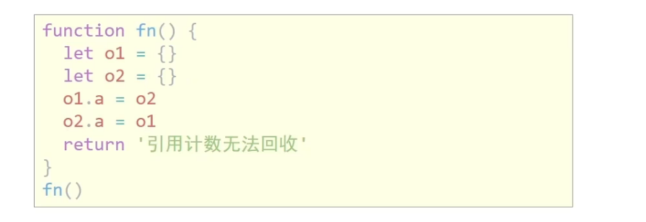
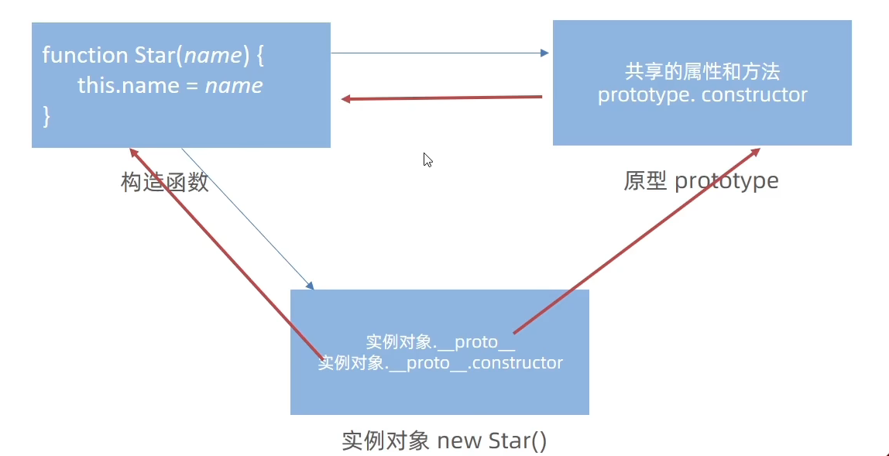
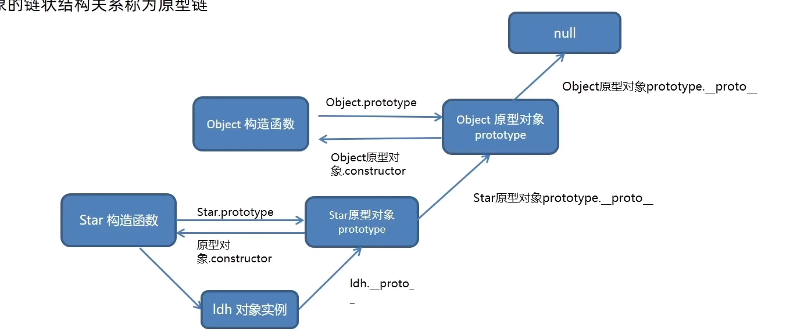
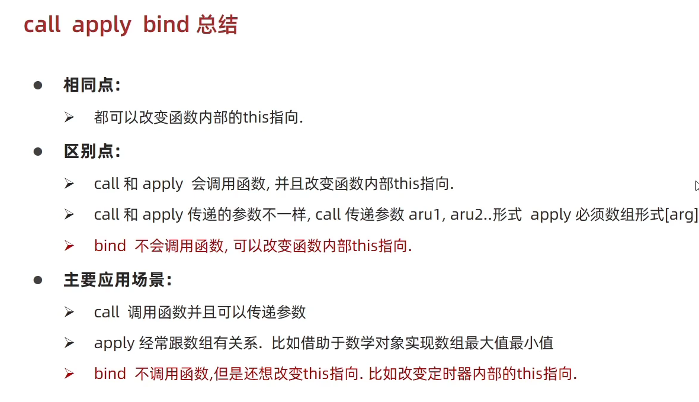
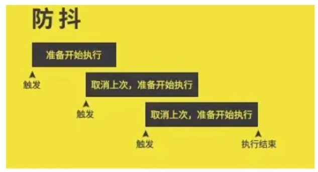
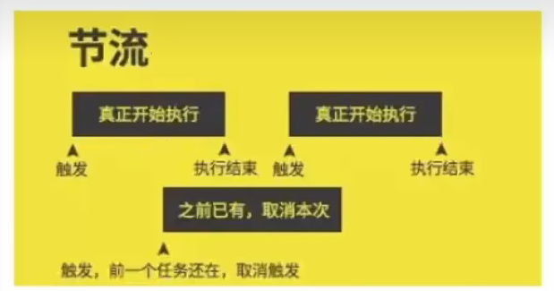

# 作用域&&解构&&箭头函数

## 作用域

### 局部作用域

局部作用域分为**函数作用域与块作用域**

1. **函数作用域**

在函数内部声明的变量只能在函数内部被访问，外部无法直接访问

- 函数内部声明的变量，在函数外部无法被访问
- 函数的参数也是函数内部的局部变量
- 不同函数内声明的变量无法互相访问
- 函数执行完毕后，函数内部的变量实际被清空了


2. **块作用域**

在JavaScript中使用{}包裹的代码即代码块，代码块内部声明的变量外部**有可能**无法访问

- **let或const声明的变量会产生块作用域，而var不会**
- 不同代码块之间的变量无法互相访问
- 推荐使用let和const


### 全局作用域

**<script>标签和.js文件的最外层**就是所谓的全局作用域，在此声明的变量在函数内部也可以被访问

全局作用域中声明的变量，任何其他作用域都可以被访问

> - 为window对象动态添加的属性默认是全局的，**不推荐**
> - 函数中未使用任何关键字声明的变量为全局变量，**不推荐**
> - 尽可能少地使用全局变量，防止变量污染


### 作用域链

作用域链本质上是底层的**变量查找机制**

- 在函数被执行时，会**优先查找当前**函数作用域中查找变量
- 如果当前作用域查找不到则会依次**逐级查找父级作用域**直到全局作用域

> 总结：
>
> - 嵌套关系的作用域串联起来即形成了作用域链
> - 相同作用域链中按着从小到大的规则查找变量
> - 子作用域能够访问父作用域，反之不能

> 注意箭头函数的自由变量查找：
>
> 是在函数**定义**的地方，向上级查找，而不是在执行的地方

### 垃圾回收机制

**垃圾回收机制（Garbage Collection）简称GC**

JS中内存的分配和回收都是自动完成的，内存在不使用的时候会被垃圾回收器，自动回收

#### 内存的生命周期

1. 内存分配：当我们声明变量、函数、对象的时候，系统会自动为他们分配内存
2. 内存使用：即读写内存
3. 内存回收：使用完毕，垃圾回收器自动回收不再使用的内存


> 说明：
>
> - 全局变量一般不会回收(关闭页面回收)
> - 一般情况下，局部变量的值，不用了，就会被自动回收
> - **内存泄漏**：程序中分配的内存由于某种原因程序未释放或无法释放叫做内存泄漏


#### 算法说明

> 堆栈空间分配说明：
>
> 1. 栈(操作系统):由**操作系统自动分配释放**函数的参数值、局部变量等，**基本数据类型放到栈**中
> 2. 堆(操作系统):一般由程序员分配释放，若**程序员不释放，由垃圾回收机制回收**，**复杂数据类型放到堆**中

##### 引用计数法

 IE采用的引用计数算法，定义“内存不再使用”，就是看一个**对象**是否有指向它的引用，没有引用了就回收对象

算法：

- 跟踪记录被引用的次数
- 如果被引用了一次，那么就记录次数1，多次引用会累加++
- 如果减少一个引用就减1
- 如果引用次数为0，就释放内存

> **缺点：**
>
> 如果两个对象相互引用，即使它们已经不再使用，垃圾回收器也不会进行回收，导致内存泄漏
>
> 
>
> 这样的函数每次调用都会导致内存泄漏


##### 标记清除法

核心：

- 标记清除算法将“不再使用的对象”重新定义为“**无法达到的对象**”
- 就是从**根部**(在JS中就是全局对象)出发定时扫描内存中的对象，**凡是能够从根部到达的对象，都是需要使用的**
- 那些**无法由根部出发触及的对象被标记为不再使用**，稍后**进行回收**


### 闭包

概念：一个函数对周围状态的引用捆绑在一起，内层函数中访问到外层函数的作用域

**简单理解：闭包 = 内层函数 + 外层函数的变量**

**作用：封闭数据，提供操作，外部也可以访问函数内部的变量，可以理解为一种封装，可以实现数据私有**

常见写法如下：

```javascript
    function outer() {
      let uname = 'haha'
      let age = 20
      function getName() {
        console.log(uname)
      }
      return getName
    }
    let getName = outer()
    getName()
```

> 这样便实现了内部变量uname和age的私有，但是outer作为一个函数，由于是outer返回了一个函数一直被使用，因此根据标记清除法该outer函数内存并不会被回收，本应被释放的内存最终可能未被释放，因此闭包可能引起 **内存泄漏**
>
> 例子：
>
> ```javascript
> function makeFunc() {
>   var name = "Mozilla";
>   function displayName() {
>     alert(name);
>   }
>   return displayName;
> }
>
> var myFunc = makeFunc();
> myFunc();
> //JavaScript 中的函数会形成了闭包。 闭包是由函数以及声明该函数的词法环境组合而成的。该环境包含了这个闭包创建时作用域内的任何局部变量。在本例子中，myFunc 是执行 makeFunc 时创建的 displayName 函数实例的引用。displayName 的实例维持了一个对它的词法环境（变量 name 存在于其中）的引用。因此，当 myFunc 被调用时，变量 name 仍然可用，其值 Mozilla 就被传递到alert中。
> ```


### 变量提升

- 变量提升仅**针对var声明变量**，它允许变量在使用之后再声明变量
- 把所有var声明的变量提升到 **当前作用域的最前面**
- 只提升声明，==不提升赋值==
- let/const声明的变量不存在变量提升

```javascript
    console.log(num);
    var num = 10
//相当于
    var num
    console.log(num);
    num = 10
//输出undefined
```


## 函数进阶

### 函数提升

与变量提升类似的定义

- **会把所有函数的声明提升到当前作用域的最前面**
- 只提升函数声明，不提升函数调用
- 提倡先声明函数，再调用
- **特殊地，函数表达式不存在函数提升**


### 函数参数

#### 动态参数

在函数中存在一个==伪数组==arguments，它存储了当前函数传递的参数值

```javascript
    function getSum() {
      console.log(arguments);
      let sum = 0
      for (let i = 0; i < arguments.length; i++) {
        sum += arguments[i]
      }
      console.log(sum);
    }
    getSum(1, 2, 3, 5, 8)
```

#### 剩余参数

剩余参数运行我们将一个不定数量的参数表示为一个数组

- ...是语法符号，置于最末函数形参之后，用于获取多余的实参
- 借助...获取的剩余实参，是个==真数组==
- 较动态参数，推荐使用剩余参数

```javascript
    function getSum(a, b, ...arr) {
      console.log(arr);
    }
    getSum(1, 2)
    getSum(1, 2, 3)
```


### 箭头函数(重要)

**目的**：引入箭头函数的目的是使得更简短的函数写法且不绑定this，箭头函数的语法比函数表达式更简洁

**使用场景**：箭头函数更适合需要==匿名函数（函数表达式和立即执行函数）的地方==

#### 基本语法：

```javascript
    const fn = function (x) {
      console.log(x);
    }
    
    const fn1 = (x) => {
      console.log(x);
    }
    fn1(11)

    //只有一个参数可以省略小括号
    const fn2 = x => {
      console.log(x);
    }
    fn2(11)

    //函数内只有一条语句可以省略大括号
    const fn3 = x => console.log(x);
    fn3(11)

    const fn4 = x => {
      return x + x
    }
    //只有一行return代码可以省略return
    console.log(fn4(1));

    const fn5 = x => x + x
    console.log(fn5(1));

    //事件写法
    const form = document.querySelector('form')
    form.addEventListener('submit', e => e.preventDefault())

    //可以直接返回一个对象 这里的对象要加上小括号表示整体 避免语义冲突
    const fn6 = (uname) => ({ name: uname })
    console.log(fn6('HAHA'));
```

> **如果箭头函数需要返回一个对象，那么需要使用小括号进行包裹，否则会出现语法矛盾**

#### 箭头函数参数

-  普通函数有arguments动态参数
- ==箭头函数没有arguments动态参数，但是有剩余参数...args==


#### 箭头函数this

一般函数/方法里的this，这个函数/方法是谁调用的this就指向谁


但是在箭头函数里面，==箭头函数不会创建自己的this，它只会从自己的作用域链的上一层沿用this==

箭头函数的 `this` 值是由定义它的上下文决定的。这意味着箭头函数的 `this` 值与**其最近一层非箭头函数的作用域**中的 `this` 值相同。换句话说，箭头函数不会创建自己的 `this` 值，而是从定义它的上下文（通常是最近一层非箭头函数的作用域）继承 `this` 值。

> DOM的回调函数不推荐使用箭头函数，特别是在需要使用到this的时候


## 解构赋值

### 数组解构

数组解构是 **将数组单位值快速批量赋值给一系列变量的简洁语法**

**基本语法：**

1. 赋值运算符 = 左侧的[]用于批量声明变量，右侧的数组单元值将被赋值给左侧变量
2. 变量的顺序对应数组单元值的位置依次进行赋值

```javascript
    // const arr = [100, 60, 80]
    // const max = arr[0]
    // const min = arr[1]
    // const avg = arr[2]
    // console.log(max, min, avg);
    //解构写法如下
    const [max1, min1, avg1] = [100, 60, 80]
    console.log(max1, min1, avg1);
```

> 应用：
>
> ```javascript
>     let a = 10
>     let b = 20;//注意分号
>     [b, a] = [a, b]
>     console.log(a);
>     console.log(b);
> ```
>
> **需要使用分号的两种情况：**
>
> 前面我们已经学过的**立即执行函数**是要求要使用分号隔开的
>
> 此外，==使用数组开头的时候==也需要加上分号隔开
>
> 如下
>
> 
>
> 如果不加上分号JS解释器会将上图代码解释为``'hhh'[1,2,3].map()``导致浏览器报错

- 变量多，单元值少的情况下(可以设置默认值解决)
  - 多余的变量会被赋值为undefined
- 变量少，单元值多的情况下(可以利用剩余参数解决，**但只能置于最末位**)
  - 多余的单元值会被忽略
- 按需导入赋值

```javascript
    const [a, b, , c] = [1, 2, 3, 4]
    console.log(a, b, c);
//输出1 2 4
```

- 多维数组的解构

```javascript
    // const [a, b, c] = [1, 2, [3, 4]]
    // console.log(a);
    // console.log(b);
    // console.log(c);
    const [a, b, [c, d]] = [1, 2, [3, 4]]
    console.log(a);
    console.log(b);
    console.log(c);
    console.log(d);
```


### 对象解构

对象解构是将对象属性和方法快速赋值给一系列变量的简洁语法

- 基本语法

```javascript
    const obj = {
      uname: 'HAHA',
      age: 18
    }
    const { age, uname } = obj
    console.log(uname, age);	
```

- 对象属性的值将被赋值给与==属性名相同的变量==
  - 但是对象解构的变量名，可以重新改名``旧变量名:新变量名``
- 注意解构的变量名不要与外面的变量名冲突，否则要报错
- 对象中找不到与变量名一致的属性值时变量值为undefined


- **解构数组对象**

```javascript
    const pig = [
      {
        uname: '乔治',
        age: 5
      }
    ]
    const [{ uname, age }] = pig
    console.log(uname, age);
```


- 嵌套对象的解构
  - 因为对象是无序的，我们需要在解构时指定哪个对象进行解构

```javascript
    const pig =
    {
      name: '乔治',
      family: {
        father: '猪爸爸',
        mother: '猪妈妈',
        brother: '佩奇'
      },
      age: 5
    }
    const { name: uname, family: { father, mother, brother } } = pig
    console.log(uname, father, mother, brother);
```

- 函数传参同时解构

```javascript
    function render({ data }) {
      console.log(data);
    }
    render(msg) 
```


# 构造函数&&数据常用函数

## 深入对象

### 创建对象的三种方式

#### 通过对象字面量创建

```javascript
    const obj1 = {
      uname: '佩奇'
    }
```

#### 通过new Object 创建

本质是通过系统给的构造函数进行创建

```javascript
const obj2 = new Object({ uname: '佩奇' })
```

#### 通过构造函数创建

- 构造函数 是一种特殊的函数，主要用于初始化对象
- 使用场景：通过构造函数来快速创建多个类似的对象
- 说明：
  - 使用new关键字调用函数的行为被称为**实例化**
  - 实例化构造函数没有参数时可以省略小括号
  - 构造函数内部无需写return，返回值即新创建的对象
  - new Object() newDate() 都是实例化构造函数 

> **约定**：
>
> 1. 构造函数的命名以大写字母开头
> 2. 它们只能使用new操作符执行


#### new实例化执行过程

1. 创建一个新的空对象
2. 将构造函数的this指向这个空对象
3. 执行构造函数代码，修改this，添加新属性
4. 返回该对象


### 实例成员与静态成员

- **通过构造函数创建的对象称为实例对象，实例对象中的属性和方法称为实例成员**（实例属性和实例方法）

> 1. 为构造函数传入参数，创建结构相同但值不同的对象
> 2. 构造函数创建的实例对象彼此独立互不影响

- **构造函数本身的属性和方法被称为静态成员**（静态属性和静态方法）

> 1. 静态成员只能由构造函数访问
> 2. 静态方法中的this指向==构造函数==
>
> 例如： Date.now() Math.PI Math.random()
>
> ```javascript
>     function Person(uname) {
>       this.uname = uname
>     }
>     Person.work = 1
>     Person.sayHi = function () {
>       console.log('打招呼' + this.work)
>     }
>     Person.sayHi()
> ```
>
> 

## 内置构造函数

### 包装类型

在JavaScript中最主要的数据类型有6种：

基本数据类型：

- 字符串、数值、布尔、undefined、null

引用数据类型：

- 对象

但是我们发现即使是基本数据类型字符串也有str.length属性

这是因为这些基本数据类型实际上都有专门的构造函数，我们称为 **包装类型**，例如String、Boolean、Number

```javascript
    const str = 'HHH'
    //底层实现如下
    const str = new String('hhh')
```

JS中几乎所有数据都可以基于构造函数创建

### Object

#### Object.keys()

- 获取对象中所有的属性
- 语法：

```javascript
    const o = { uname: '佩奇', age: 6 }
    console.log(Object.keys(o));
```

- 注意：
  - 返回的是一个数组


#### Object.values()

- 获取对象中所有的属性值
- 语法：

```javascript
    const o = { uname: '佩奇', age: 6 }
    console.log(Object.values(o));
```

- 注意：
  - 返回的是一个数组


#### Object.assign()

- 用于对象拷贝(浅拷贝)
- 使用场景：给对象新增属性，同名属性会覆盖

```javascript
    const o = { uname: '佩奇', age: 6 }
    // console.log(Object.keys(o));
    // console.log(Object.values(o));
    const oo = {}
    Object.assign(oo, o)
    Object.assign(oo, { gender: '女' })
    console.log(oo);
```


### Array


#### reduce()

- reduce返回累加处理的结果，经常用于求和等操作
- 基本语法


```javascript
const array1 = [1, 2, 3, 4];

// 0 + 1 + 2 + 3 + 4
const initialValue = 0;
const sumWithInitial = array1.reduce((accumulator, currentValue) => accumulator + currentValue, initialValue);

console.log(sumWithInitial);
// Expected output: 10

```

reducer 逐个遍历数组元素，每一步都将当前元素的值与前一步的结果相加（该结果是之前所有步骤结果的总和）——直到没有更多需要相加的元素。

> 第一次调用回调时初始化 `accumulator` 的值。如果指定了 `initialValue`，则 `callbackFn` 从数组中的第一个值作为 `currentValue` 开始执行，同时`accumulator`初始化为`initialValue`。如果没有指定 `initialValue`，则 `accumulator` 初始化为数组中的**第一个值**，并且 `callbackFn` 从数组中的第二个值作为 `currentValue` 开始执行。
>
> `callbackFn`为数组中每个元素执行的函数。其返回值将作为下一次调用 `callbackFn` 时的 `accumulator` 参数。对于最后一次调用，返回值将作为 `reduce()` 的返回值。

#### 静态方法Array.from()

- 伪数组转换为真数组

```javascript
const arr = Array.from(伪数组)
```


#### 常见其他实例方法

- **实例方法**`join`数组元素拼接为字符串，返回字符串
- 实例方法`find`查找元素，返回符合测试条件的第一个数组元素，没有符合条件则返回undefined(**注意**：find得到的对象是原数组中元素的同一个引用，即修改该返回值，原数组会受到影响)
- 实例方法`every`检测数组所有元素是否**都符合**指定条件，如果**所有元素**都符合条件返回true，反之返回false
- 实例方法`some` 检测数组元素是否**存在符合**指定条件，**存在一个元素**都符合条件返回true，反之返回false
- 实例方法`concat`合并两个数组，返回新数组
- 实例方法`sort`对数组进行排序
- 实例方法`splice`删除或替换元素
- 实例方法`reverse`反转数组 
- 实例方法`findIndex`查找元素索引值


### String

#### 常见实例属性/方法

1. 实例属性`length`用于获取字符串长度
2. **实例方法**`split('分隔符')`用于将字符串拆分为数组(即数组join方法的相反)
3. 实例方法`subString(开始下标，结束下标)`用于字符串截取(其中范围为左闭右开)
4. 实例方法`startsWith(搜索字符串, 开始索引)`用于判断是否字符串以搜索字符串开头，其中开始索引可省
5. 实例方法`includes(搜索字符串, 开始索引)`用于判断一个字符串是否包含在另一个字符串中，其中开始索引可省
6. 实例方法`toUpperCase`用于将字符串字母转换成大写
7. 实例方法`toLowerCase`用于将字符串字母转换成小写
8. 实例方法`indexOf`用于检测是否包含某个子串
9. 实例方法`endsWith`用于检测是否以某个字符串结尾
10. 实例方法`replace`用于替换字符串，支持正则匹配
11. 实例方法`match`用于查找字符串，支持正则匹配
12. 实例方法``slice``截取字符串


### Number

#### toFixed()实例方法

- 设置保留小数位的长度(**四舍五入**) 


# 深入面向对象

## 编程思想

### 面向过程编程

- 面向过程即分析出解决问题所需的步骤，然后用函数把这些步骤一步一步实现，使用时依次调用
- 优点：性能比面向对象高，适合与硬件相关的东西
- 缺点：没有面向对象易维护、易复用、易扩展

### 面向对象编程(OOP)

- 面向对象是把问题分解为一个一个的对象，由对象之间分工合作
- 优点：易维护、易复用、易扩展
- 缺点：性能较面向过程低
- 特性
  - 封装
  - 继承
  - 多态


## 构造函数

JS通过构造函数实现了封装，构造函数实例创建的对象彼此独立互不影响

当一个函数被使用 `new` 操作符执行时，它按照以下**步骤**：

1. 一个新的空对象被创建并分配给 `this`。
2. 函数体执行。通常它会修改 `this`，为其添加新的属性。
3. 返回 `this` 的值。

换句话说，`new User(...)` 做的就是类似的事情：

```js
function User(name) {
  // this = {};（隐式创建）

  // 添加属性到 this
  this.name = name;
  this.isAdmin = false;

  // return this;（隐式返回）
}
```

> 但是它存在**内存浪费问题**，即如果一个类中存在公共属性和公共方法，单单使用构造函数进行创建类的话，每一个实例对象都会单独用于该属性和方法，导致内存浪费


## 原型

### 什么是原型

- 构造函数通过原型分配的函数是所有对象所==共享的==
- JavaScript规定，==每个构造函数都有一个prototype属性==，指向另一个对象，我们称之为==原型对象==
- 这个对象可以挂载函数，对象实例化不会多次在内存上创建函数，节约内存
- 因此我们可以把那些公共的方法，直接定义在prototype对象上
- ==构造函数与原型对象上的this都指向 实例化的对象==


### constructor属性

- 每个原型对象里面都有一个constructor属性
- 该属性指向该原型对象的构造函数


> 如果存在多个公共方法需要赋值给原型对象，一个一个添加效率不高，我们可以使用直接赋值的方式，但是要注意，直接赋值会覆盖掉原先原型对象里的constructor属性，因此需要重新添加一个constructor属性指向构造函数
>
> ```javascript
>     function Star() {
>
>     }
>     Star.prototype = {
>       constructor: Star,
>       sing: function () {
>         console.log('唱歌');
>       },
>       dance: function () {
>         console.log('跳舞');
>       },
>       movie: function () {
>         console.log('演戏');
>       }
>     }
> ```
>
> 

### 对象原型

**对象都有一个属性_ _proto__**指向构造函数的prototype原型对象，这也是我们实例对象可以使用构造函数原型对象的属性和方法的原因，**因为_ _proto__是实例对象里的原型故简称对象原型**



注意：

- _ _proto__是JS非标准属性，即非标准写法
- 它是**只读的**
- [[prototype]]和_ _proto__意义相同
- 用于表明当前实例对象指向哪个原型对象  
- **_ _proto__也拥有constructor属性指向构造函数**


### 原型继承

JavaScript中的继承是借助原型对象实现的

- 我们将构造函数看作类，父构造函数即父类，子构造函数即子类
- 继承的关键步骤就是：==子构造函数.prototype = new 父类==

```javascript
    function Person() {
      this.eyes = 2
      this.head = 1
    }
    function Man() {

    }
    Man.prototype = new Person()
    const man = new Man()
    function Woman() {

    }
    Woman.prototype = new Person()
    Woman.prototype.baby = function () {//添加woman特有的方法
      console.log('生孩子');
    }
    const woman = new Woman()
    console.log(man);
    console.log(woman);
```


### 原型链

基于原型对象的继承使得不同构造函数的原型对象关联在一起，这种关联的关系是一种链式的结构，我们将原型对象的链状结构关系称为**原型链**



- 原型链是一种**查找规则**
  1. 当访问一个对象的成员时，首先查找这个对象自身有没有该成员
  2. 如果没有就查找它的原型对象(即__proto指向的prototype对象)
  3. 如果还没有就查找原型对象的原型(Object的原型对象)
  4. 以此类推直到找到Object为止(null)
  5. __proto对象原型的意义即在于**为对象成员查找机制提供一个方向**/路线
  6. 可以使用**instanceof**运算符检测构造函数的prototype属性是否出现在某个实例对象的原型链上(也可以理解为判断某个对象是否属于某个类)

> 记忆：
>
> 只要是对象就有__proto属性，只要是原型对象就有constructor属性


# 高阶技巧

## 深浅拷贝

首先需要明确的是，深拷贝与浅拷贝都只针对引用类型

想要进行引用数据类型的拷贝操作，不能进行简单的赋值=操作，因为这样只是进行了地址的赋值，修改其中一个，另外一个也会改变

### 浅拷贝

对于简单的对象(内部未嵌套对象)，拷贝的常见方法如下：

- 拷贝对象：Object.assign() / 使用展开运算符{...obj}拷贝对象
- 拷贝数组：Array.prototype.concat()  或  [...]

> 浅拷贝在遇到嵌套的引用数据类型时，进行拷贝的只有地址

### 深拷贝

深拷贝在遇到嵌套的引用数据类型时，对内层的对象不再只是拷贝地址，而是对象本身都进行拷贝

#### 深拷贝简易实现

```javascript
    const obj = {
      uname: 'HAHA',
      age: 18,
      family: {
        uname: 'XIXI'
      },
      arr: ['篮球', '乒乓球']
    }
    const o = {}
    function deepCopy(newObj, oldObj) {
      for (let key in oldObj) {
        if (oldObj[key] instanceof Array) {
          newObj[key] = []//新增数组
          deepCopy(newObj[key], oldObj[key])//遍历数组赋值
          continue
        }
        else if (oldObj[key] instanceof Object) {
          newObj[key] = {}//新增对象
          deepCopy(newObj[key], oldObj[key])//遍历对象进行赋值
          continue
        }
        //遍历元素进行赋值
        newObj[key] = oldObj[key]
      }
    }
    deepCopy(o, obj)
    o.age = 20
    o.family.age = 22
    o.arr[0] = '足球'
    console.log(o);
    console.log(obj);
```

> 注意上述代码的判断语句Array必须先于Object判断，因为在遇到数组时，如果Object先判断则进入Object判断，便不会进入Array了(数组也属于Object)


#### lodash实现深拷贝

Lodash是一个一致性、模块化、高性能的JavaScript实用库

[Lodash 简介 | Lodash中文文档 | Lodash中文网 (lodashjs.com)](https://www.lodashjs.com/)

```javascript
  <script src="../06-素材(3)/lodash.min.js"></script>
  <script>
    const obj = {
      uname: 'HAHA',
      age: 18,
      family: {
        uname: 'XIXI'
      },
      arr: ['篮球', '乒乓球']
    }
    const o = _.cloneDeep(obj)
    o.age = 20
    o.family.age = 22
    o.arr[0] = '足球'
    console.log(o);
    console.log(obj);
```

#### JSON实现深拷贝

先使用JSON.stringify将旧对象转换为字符串，再将该字符串使用JSON.parse转换为对象即可

```javascript
    const obj = {
      uname: 'HAHA',
      age: 18,
      family: {
        uname: 'XIXI'
      },
      arr: ['篮球', '乒乓球']
    }
    const o = JSON.parse(JSON.stringify(obj))
    o.age = 20
    o.family.age = 22
    o.arr[0] = '足球'
    console.log(o);
    console.log(obj);
```


## 异常处理

异常处理是指预估代码执行过程中可能发生的错误，然后最大程度地避免错误的发生导致整个程序无法继续运行

### throw抛异常

- throw抛出异常，程序即终止
- throw后面跟的是错误提示信息
- Error对象配合throw使用，能够设置更详细的错误信息


### try/catch 捕获异常

这里与Java的异常处理类似的

- try...catch用于捕获错误信息
- 将预估可能发生错误的代码写在try代码段中
- 如果try代码段中发生错误，则执行catch代码段，并将错误信息传递给catch作为形参
- finally不论代码是否发生错误都会执行


### debugger

可以在代码中直接写上debugger，则打开该页面刷新进入断点调试


## 处理this

### this指向

 #### 普通函数

谁调用了this，那么this就指向谁

> 普通函数没有明确调用者时，this值为window，但是在严格模式下，没有调用者时，this值为undefined 
>
> 在代码某处写上'use strict'即在此之下都开启严格模式


#### 箭头函数

箭头函数中的this与普通函数完全不同，也不受调用方式的影响，事实上箭头函数不存在this

- 箭头函数会默认帮我们绑定外层this的值，所以在箭头函数中this的值和外层的this是一样的
- 箭头函数中this的引用的是最近作用域中的this
- 向外层作用域中，逐层查找this，直到找到this定义

>1. 在DOM的事件回调函数中如果考虑使用DOM对象的this，不推荐使用箭头函数
>2. 原型对象的面向对象也不推荐使用箭头函数

### 改变this

JavaScript允许指定函数中this的指向，有3个方法可以动态指定普通函数中this的指向

#### call()（了解）

使用call调用函数，同时指定被调用函数的中this的值

- 语法：

``fun.call(thisArg, arg1, arg2, ...)``

- thisArg：即希望this的指向值
- arg1, arg2：即该函数的参数
- 返回值就是函数的返回值，因为本质就是调用函数


#### apply()

与call类似的，使用apply方法调用函数，同时指定被调用函数中this的值

- 语法：

``fun.apply(thisArg, [argsArray])``

- thisArg：即希望this的指向值
- argsArray：函数的参数，可以是真数组/伪数组
- 返回值就是函数的返回值，因为本质就是调用函数

> apply与call的区别即传递参数时是使用数组作为形参的
>
> 应用：
>
> 求数组最大值
>
> ```javascript
> const arr = [1, 2, 3, 5, 1]
> Math.max.apply(null, arr)
> Math.max(...arr)
> ```


#### bind()

- bind不会调用函数，能改变this指向
- 语法：

``fun.bind(thisArg, arg1, arg2, ...)``

- thisArg：即希望this的指向值
- arg1, arg2：即该函数的参数
- **返回由指定this值和初始化参数改造的 原函数拷贝(新函数)**
- 因此我们如果想改变this指向，但是不想调用该函数时，可以使用bind，例如改变定时器的bind

```javascript
  <button>按钮</button>
  <script>
    document.querySelector('button').addEventListener('click', function () {
      this.disabled = true
      // setTimeout(function () {
      //   btn.disabled = false
      // }, 1000)

      // setTimeout(() => this.disabled = false, 1000)

      // setTimeout(function () {
      //   this.disabled = false
      // }.bind(btn), 1000)
    })
  </script>
```




# 性能优化

## 防抖

- **单位事件内，频繁触发事件，==只执行最后一次== **
- 就是指触发事件后，在 n 秒内函数只能执行一次，如果触发事件后在 n 秒内又触发了事件，则会重新计算函数延执行时间



- 为什么需要防抖
  - 前端开发过程中，有一些事件，常见的例如，**onresize**，**scroll**，**mousemove** ,**mousehover** 等，会被频繁触发（短时间内多次触发），不做限制的话，有可能一秒之内执行几十次、几百次，如果在这些函数内部执行了其他函数，尤其是执行了操作 DOM 的函数（浏览器操作 DOM 是很耗费性能的），那不仅会浪费计算机资源，还会降低程序运行速度，甚至造成浏览器卡死、崩溃。
- 应用场景：搜索框输入，手机号、邮箱验证输入检测
- 核心
  - 需要一个 **setTimeout** 来辅助实现，延迟运行需要执行的代码。如果方法多次触发，则把上次记录的延迟执行代码用 **clearTimeout** 清掉，重新开始计时。若计时期间事件没有被重新触发，等延迟时间计时完毕，则执行目标代码
- 实现
  - lodash提供了防抖函数
  - 自己实现

```javascript
    function debounce(fn, t) {
      let timeId
      return function () {
        if (timeId) {
          clearTimeout(timeId)
        }
        timeId = setTimeout(fn, t)
      }
    }
    box.addEventListener('mousemove', debounce(mouseMove, 100))
//这里的debounce函数实际上只会被调用1次，并且在返回的函数中使用到了timeId这个变量（或者说返回的对象维持了对它的词法环境(变量timeId存在于其中的)的引用），因此实际上利用了闭包，这里的timeId在内存中并不会被清除
```

如下是未实现防抖的效果


使用了防抖的效果后


## 节流

- **单位时间内，频繁触发事件，==只执行一次==**



- 对比防抖，可以发现，在每一次事件触发后，**节流取消的是本次事件，而防抖取消的是前一次事件**
- 应用场景：鼠标移动mousemove，页面尺寸缩放resize、滚动条滚动scroll 
- 实现方式
  - lodash提供的节流函数_.throttle
  - 手写实现简易节流


```javascript
const throttle = function(fn, delay = 300, isImmediately = false) {
  let timer = null;
  return function() {
      const that = this; // 存储一下当前的this指向
      const args = arguments; // 拿到传递的参数信息
      if (!timer) {
        timer = setTimeout(function() {
          fn.apply(that, args);
          timer = null;
        }, delay)
      }
  }
}

```


节流效果图


