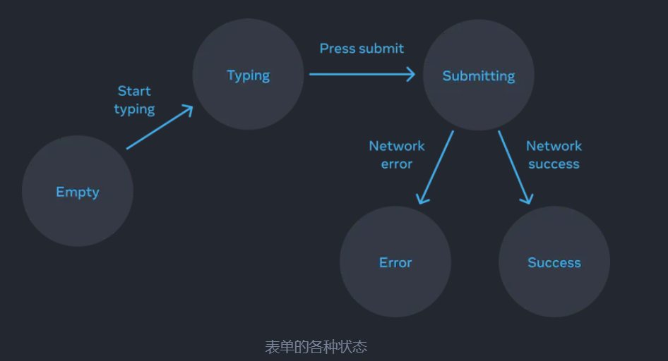
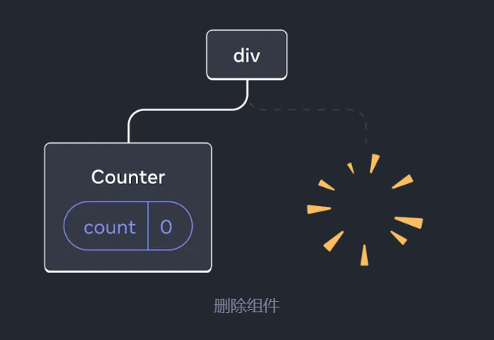
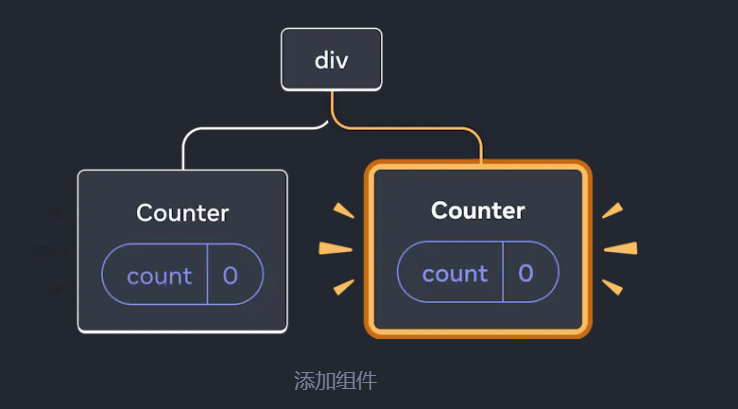
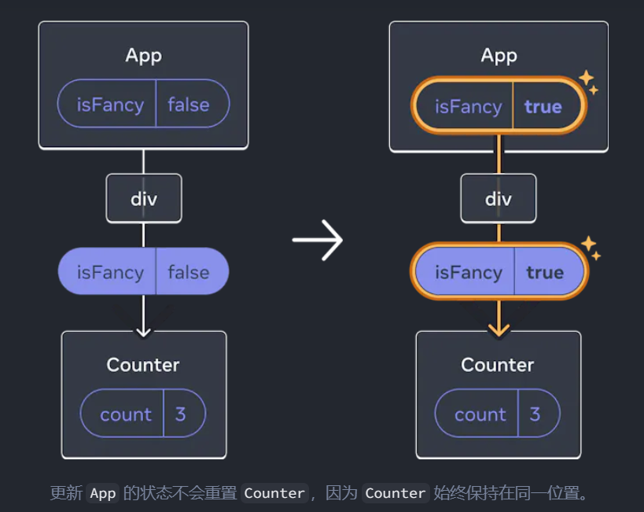
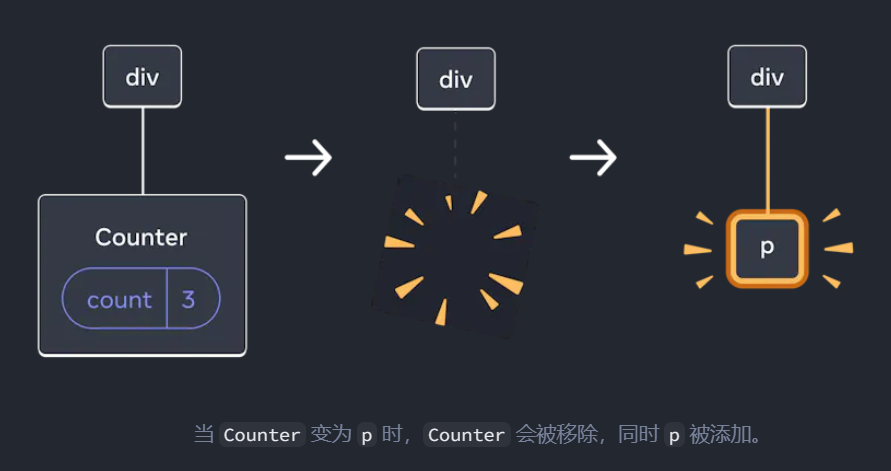
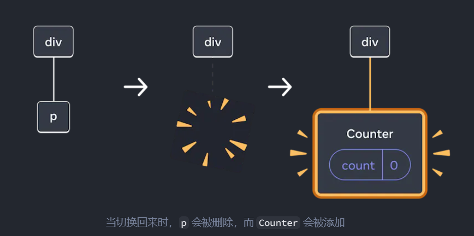
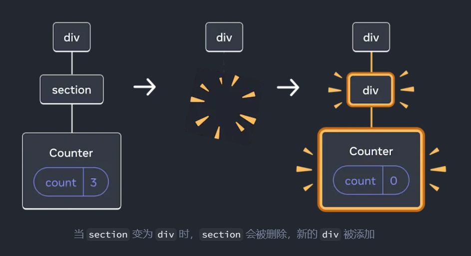
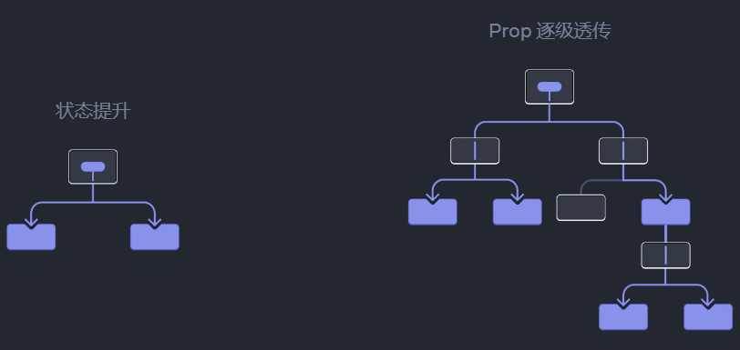
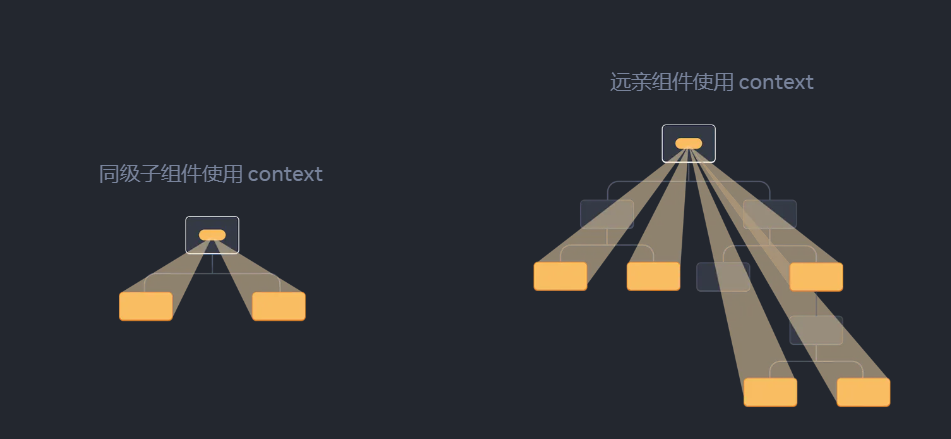
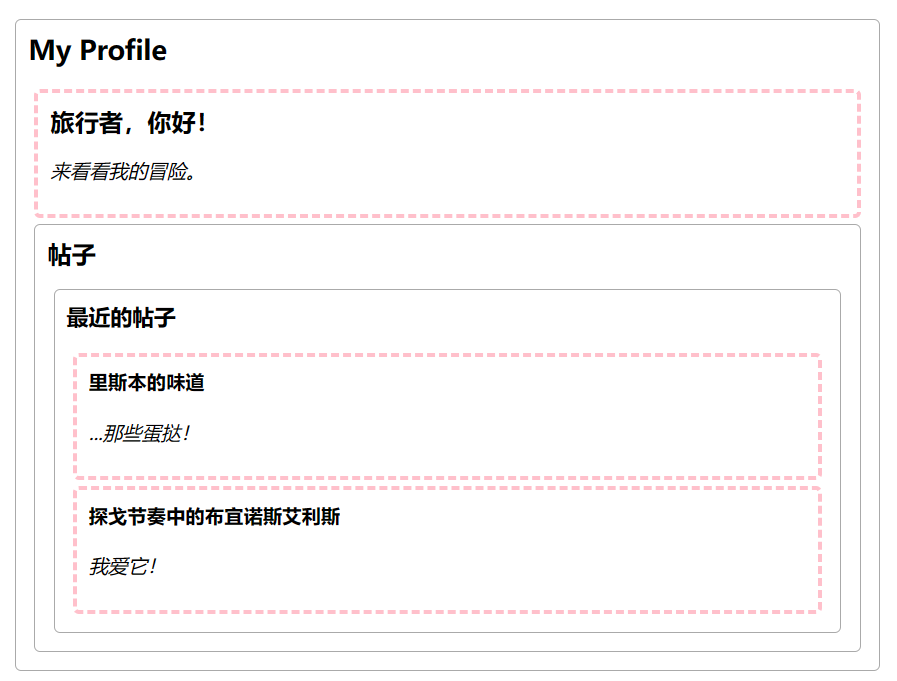

# 状态管理

随着你的应用不断变大，更有意识的去关注应用状态如何组织，以及数据如何在组件之间流动会对你很有帮助。冗余或重复的状态往往是缺陷的根源。在本节中，你将学习如何组织好状态，如何保持状态更新逻辑的可维护性，以及如何跨组件共享状态。


## 用state响应输入

React 控制 UI 的方式是声明式的。你不必直接控制 UI 的各个部分，只需要声明组件可以处于的不同状态，并根据用户的输入在它们之间切换。这与设计师对 UI 的思考方式很相似。

### 声明式UI与命令式UI的比较

当你设计 UI 交互时，可能会去思考 UI 如何根据用户的操作而响应**变化**。想象一个让用户提交答案的表单：

- 当你向表单输入数据时，“提交”按钮会随之变成**可用状态**
- 当你点击“提交”后，表单和提交按钮都会随之变成**不可用状态**，并且会加载动画会随之**出现**
- 如果网络请求成功，表单会随之**隐藏**，同时“提交成功”的信息会随之**出现**
- 如果网络请求失败，错误信息会随之**出现**，同时表单又变为**可用状态**

在 **命令式编程** 中，以上的过程直接告诉你如何去实现交互。你必须去根据要发生的事情写一些明确的命令去操作 UI。对此有另一种理解方式，想象一下，当你坐在车里的某个人旁边，然后一步一步地告诉他该去哪。


他并不知道你想去哪，只想跟着命令行动。（并且如果你发出了错误的命令，那么你就会到达错误的地方）正因为你必须从加载动画到按钮地“命令”每个元素，所以这种告诉计算机**如何**去更新 UI 的编程方式被称为**命令式编程**

在这个命令式 UI 编程的例子中，表单**没有使用** React 生成，而是使用原生的 [DOM](https://developer.mozilla.org/zh-CN/docs/Web/API/Document_Object_Model):

```jsx
async function handleFormSubmit(e) {
  e.preventDefault();
  disable(textarea);
  disable(button);
  show(loadingMessage);
  hide(errorMessage);
  try {
    await submitForm(textarea.value);
    show(successMessage);
    hide(form);
  } catch (err) {
    show(errorMessage);
    errorMessage.textContent = err.message;
  } finally {
    hide(loadingMessage);
    enable(textarea);
    enable(button);
  }
}

function handleTextareaChange() {
  if (textarea.value.length === 0) {
    disable(button);
  } else {
    enable(button);
  }
}

function hide(el) {
  el.style.display = 'none';
}

function show(el) {
  el.style.display = '';
}

function enable(el) {
  el.disabled = false;
}

function disable(el) {
  el.disabled = true;
}

function submitForm(answer) {
  // Pretend it's hitting the network.
  return new Promise((resolve, reject) => {
    setTimeout(() => {
      if (answer.toLowerCase() === 'istanbul') {
        resolve();
      } else {
        reject(new Error('Good guess but a wrong answer. Try again!'));
      }
    }, 1500);
  });
}

let form = document.getElementById('form');
let textarea = document.getElementById('textarea');
let button = document.getElementById('button');
let loadingMessage = document.getElementById('loading');
let errorMessage = document.getElementById('error');
let successMessage = document.getElementById('success');
form.onsubmit = handleFormSubmit;
textarea.oninput = handleTextareaChange;
```

在这个示例中，想象一下，当你需要去更新一个这样包含着不同表单的页面时，你想要添加一个新的元素/交互时，每次都需要小心地检查已经写好的内容

在 React 中，你不必直接去操作 UI —— 你不必直接启用、关闭、显示或隐藏组件。相反，你只需要 **声明你想要显示的内容，** React 就会通过计算得出该如何去更新 UI。想象一下，当你上了一辆出租车并且告诉司机你想去哪，而不是事无巨细地告诉他该如何走。将你带到目的地是司机的工作，他们甚至可能知道一些你没有想过并且不知道的捷径！


### 声明式地考虑UI

#### 确定组件中不同的视图状态

首先，你需要去可视化 UI 界面中用户可能看到的所有不同的“状态”：

- **无数据**：表单有一个不可用状态的“提交”按钮。
- **输入中**：表单有一个可用状态的“提交”按钮。
- **提交中**：表单完全处于不可用状态，加载动画出现。
- **成功时**：显示“成功”的消息而非表单。
- **错误时**：与输入状态类似，但会多错误的消息。

下面的例子，这是一个对表单可视部分的模拟。这个模拟被一个 `status` 的属性控制，并且这个属性的默认值为 `empty`。

```jsx
export default function Form({
  // Try 'submitting', 'error', 'success':
  status = 'empty'
}) {
  if (status === 'success') {
    return <h1>That's right!</h1>
  }
  return (
    <>
      <h2>City quiz</h2>
      <p>
        In which city is there a billboard that turns air into drinkable water?
      </p>
      <form>
        <textarea disabled={
          status === 'submitting'
        } />
        <br />
        <button disabled={
          status === 'empty' ||
          status === 'submitting'
        }>
          Submit
        </button>
        {status === 'error' &&
          <p className="Error">
            Good guess but a wrong answer. Try again!
          </p>
        }
      </form>
      </>
  );
}

```


#### 确定是什么触发了这些状态的改变

你可以触发 state 的更新来响应两种输入：

- **人为**输入：比如点击按钮、在表单中输入内容，或导航到链接（通常需要利用 **事件处理函数**）。
- **计算机**输入：比如网络请求得到反馈、定时器被触发，或加载一张图片。

以上两种情况中，**你必须设置 state 变量 去更新 UI**。对于正在开发中的表单来说，你需要改变 state 以响应几个不同的输入：

- **改变输入框中的文本时**（人为）应该根据输入框的内容是否是**空值**，从而决定将表单的状态从空值状态切换到**输入中**或切换回原状态。
- **点击提交按钮时**（人为）应该将表单的状态切换到**提交中**的状态。
- **网络请求成功后**（计算机）应该将表单的状态切换到**成功**的状态。
- **网络请求失败后**（计算机）应该将表单的状态切换到**失败**的状态，与此同时，显示错误信息。



#### 列出可能的state

接下来你会需要在内存中通过 [`useState`](https://zh-hans.react.dev/reference/react/useState) 表示组件中的视图状态。诀窍很简单：state 的每个部分都是“处于变化中的”，并且**你需要让“变化的部分”尽可能的少**。更复杂的程序会产生更多 bug！

先从**绝对必须**存在的状态开始。例如，你需要存储输入的 `answer` 以及用于存储最后一个错误的 `error` （如果存在的话）：

```jsx
const [answer, setAnswer] = useState('');
const [error, setError] = useState(null);
```

接下来，你需要一个状态变量来代表你想要显示的那个可视状态。通常有多种方式在内存中表示它


#### 删除不必要的state

你会想要避免 state 内容中的重复，从而只需要关注那些必要的部分。花一点时间来重构你的 state 结构，会让你的组件更容易被理解，减少重复并且避免歧义。


#### 在事件处理函数中设置state

```jsx
import { useState } from 'react';

export default function Form() {
  const [answer, setAnswer] = useState('');
  const [error, setError] = useState(null);
  const [status, setStatus] = useState('typing');

  if (status === 'success') {
    return <h1>That's right!</h1>
  }

  async function handleSubmit(e) {
    e.preventDefault();
    setStatus('submitting');
    try {
      await submitForm(answer);
      setStatus('success');
    } catch (err) {
      setStatus('typing');
      setError(err);
    }
  }

  function handleTextareaChange(e) {
    setAnswer(e.target.value);
  }

  return (
    <>
      <h2>City quiz</h2>
      <p>
        In which city is there a billboard that turns air into drinkable water?
      </p>
      <form onSubmit={handleSubmit}>
        <textarea
          value={answer}
          onChange={handleTextareaChange}
          disabled={status === 'submitting'}
        />
        <br />
        <button disabled={
          answer.length === 0 ||
          status === 'submitting'
        }>
          Submit
        </button>
        {error !== null &&
          <p className="Error">
            {error.message}
          </p>
        }
      </form>
    </>
  );
}

function submitForm(answer) {
  // Pretend it's hitting the network.
  return new Promise((resolve, reject) => {
    setTimeout(() => {
      let shouldError = answer.toLowerCase() !== 'lima'
      if (shouldError) {
        reject(new Error('Good guess but a wrong answer. Try again!'));
      } else {
        resolve();
      }
    }, 1500);
  });
}

```


## 选择state结构

构建良好的 state 可以让组件变得易于修改和调试，而不会经常出错


### 构建state的原则

当你编写一个存有 state 的组件时，你需要选择使用多少个 state 变量以及它们都是怎样的数据格式

以下是一些指导性的原则：

1. **合并关联的 state**。如果你总是同时更新两个或更多的 state 变量，请考虑将它们合并为一个单独的 state 变量。
2. **避免互相矛盾的 state**。当 state 结构中存在多个相互矛盾或“不一致”的 state 时，你就可能为此会留下隐患。应尽量避免这种情况。
3. **避免冗余的 state**。如果你能在渲染期间从组件的 props 或其现有的 state 变量中计算出一些信息，则不应将这些信息放入该组件的 state 中。
4. **避免重复的 state**。当同一数据在多个 state 变量之间或在多个嵌套对象中重复时，这会很难保持它们同步。应尽可能减少重复。
5. **避免深度嵌套的 state**。深度分层的 state 更新起来不是很方便。如果可能的话，最好以扁平化方式构建 state。


### 合并关联的state

- 有时候你可能会不确定是使用单个 state 变量还是多个 state 变量。

你会像下面这样做吗？

```jsx
const [x, setX] = useState(0);

const [y, setY] = useState(0);
```

或这样？

```jsx
const [position, setPosition] = useState({ x: 0, y: 0 });
```

从技术上讲，你可以使用其中任何一种方法。但是，**如果某两个 state 变量总是一起变化，则将它们统一成一个 state 变量可能更好**。

- 另一种情况是，你将数据整合到一个对象或一个数组中时，你不知道需要多少个 state 片段，例如，当你有一个用户可以添加自定义字段的表单时，这将会很有帮助。


### 避免矛盾的state

下面是带有 `isSending` 和 `isSent` 两个 state 变量的酒店反馈表单：

```jsx
import { useState } from 'react';

export default function FeedbackForm() {
  const [text, setText] = useState('');
  const [isSending, setIsSending] = useState(false);
  const [isSent, setIsSent] = useState(false);

  async function handleSubmit(e) {
    e.preventDefault();
    setIsSending(true);
    await sendMessage(text);
    setIsSending(false);
    setIsSent(true);
  }

  if (isSent) {
    return <h1>Thanks for feedback!</h1>
  }

  return (
    <form onSubmit={handleSubmit}>
      <p>How was your stay at The Prancing Pony?</p>
      <textarea
        disabled={isSending}
        value={text}
        onChange={e => setText(e.target.value)}
      />
      <br />
      <button
        disabled={isSending}
        type="submit"
      >
        Send
      </button>
      {isSending && <p>Sending...</p>}
    </form>
  );
}

// 假装发送一条消息。
function sendMessage(text) {
  return new Promise(resolve => {
    setTimeout(resolve, 2000);
  });
}

```

这样的写法尽管在逻辑上是可以跑通的，但是如果你忘记同时修改两个state，那么可能出现`isSending`和`isSent`同时为true的情况

因此，我们最好直接使用一个`status`变量来代替它们，**这个 state 变量可以采取三种有效状态其中之一**：`'typing'` (初始), `'sending'`, 和 `'sent'`:


### 避免冗余的state

如果你能在渲染期间从组件的 props 或其现有的 state 变量中计算出一些信息，则不应该把这些信息放到该组件的 state 中

例如

```jsx
  const [firstName, setFirstName] = useState('');
  const [lastName, setLastName] = useState('');
  const [fullName, setFullName] = useState('');
```

我们完全没有必要为`fullName`这个变量设置为一个state，因为这个变量可以由`firstName`和`lastName`计算出来

因此：

```jsx
const [firstName, setFirstName] = useState('');
const [lastName, setLastName] = useState('');
const fullName = firstName + ' ' + lastName;
```

更为合理

> **不要在state中镜像props：**
>
> 以下代码是体现 state 冗余的一个常见例子：
>
> ```jsx
> function Message({ messageColor }) {
>
>   const [color, setColor] = useState(messageColor);
> ```
>
> 这里，一个 `color` state 变量被初始化为 `messageColor` 的 prop 值。这段代码的问题在于，**如果父组件稍后传递不同的 messageColor 值（例如，将其从 'blue' 更改为 'red'），则 color** state 变量**将不会更新！** state 仅在**第一次渲染**期间初始化。
>
> 这就是为什么在 state 变量中，“镜像”一些 prop 属性会导致混淆的原因。相反，你要在代码中直接使用 `messageColor` 属性。如果你想给它起一个更短的名称，请使用常量：
>
> ```jsx
> function Message({ messageColor }) {
>
>   const color = messageColor;
> ```
>
> 这种写法就不会与从父组件传递的属性失去同步。
>
> 只有当你 **想要** 忽略特定 props 属性的所有更新时，将 props “镜像”到 state 才有意义。按照惯例，prop 名称以 `initial` 或 `default` 开头，以阐明该 prop 的新值将被**忽略**：
>
> ```jsx
> function Message({ initialColor }) {
>   // 这个 `color` state 变量用于保存 `initialColor` 的 **初始值**。
>   // 对于 `initialColor` 属性的进一步更改将被忽略。
>
>   const [color, setColor] = useState(initialColor);
> ```


### 避免重复的state

该点比较难以理解：

看下面的例子：

```jsx
import { useState } from 'react';

const initialItems = [
  { title: 'pretzels', id: 0 },
  { title: 'crispy seaweed', id: 1 },
  { title: 'granola bar', id: 2 },
];

export default function Menu() {
  const [items, setItems] = useState(initialItems);
  const [selectedItem, setSelectedItem] = useState(
    items[0]
  );

  function handleItemChange(id, e) {
    setItems(items.map(item => {
      if (item.id === id) {
        return {
          ...item,
          title: e.target.value,
        };
      } else {
        return item;
      }
    }));
  }

  return (
    <>
      <h2>What's your travel snack?</h2> 
      <ul>
        {items.map((item, index) => (
          <li key={item.id}>
            <input
              value={item.title}
              onChange={e => {
                handleItemChange(item.id, e)
              }}
            />
            {' '}
            <button onClick={() => {
              setSelectedItem(item);
            }}>Choose</button>
          </li>
        ))}
      </ul>
      <p>You picked {selectedItem.title}.</p>
    </>
  );
}

```

这里将所选元素作为对象存储在 `selectedItem` state 变量中。然而，这并不好：**selectedItem 的内容与 items 列表中的某个项是同一个对象。** 这意味着关于该项本身的信息在两个地方产生了重复。

这样会导致当我们更新`items`数据时触发渲染，但是`selectedItem` 却不能及时得到更新，而是需要点击才能更新

据此，我们最好只存储`selectedId` ，而不是 `selectedItem` 对象（它创建了一个与 `items` 内重复的对象）

**然后** 通过搜索 `items` 数组中具有该 ID 的项，以此获取 `selectedItem`

这样使得`selectedItem`与`items`得到关联，因此能够在`items`更新时及时更新`selectedItem`

本质上就是使得`selectedItem`这个变量由标志当前`item`的`id`来计算出来

请仔细比对下面的代码与之前代码的区别

```jsx
import { useState } from 'react';

const initialItems = [
  { title: 'pretzels', id: 0 },
  { title: 'crispy seaweed', id: 1 },
  { title: 'granola bar', id: 2 },
];

export default function Menu() {
  const [items, setItems] = useState(initialItems);
  const [selectedId, setSelectedId] = useState(0);

  const selectedItem = items.find(item =>
    item.id === selectedId
  );

  function handleItemChange(id, e) {
    setItems(items.map(item => {
      if (item.id === id) {
        return {
          ...item,
          title: e.target.value,
        };
      } else {
        return item;
      }
    }));
  }

  return (
    <>
      <h2>What's your travel snack?</h2>
      <ul>
        {items.map((item, index) => (
          <li key={item.id}>
            <input
              value={item.title}
              onChange={e => {
                handleItemChange(item.id, e)
              }}
            />
            {' '}
            <button onClick={() => {
              setSelectedId(item.id);
            }}>Choose</button>
          </li>
        ))}
      </ul>
      <p>You picked {selectedItem.title}.</p>
    </>
  );
}

```


### 避免深度嵌套的state

看这个例子：

```jsx
// 这是一个由行星、大陆、国家组成的嵌套对象数据
export const initialTravelPlan = {
  id: 0,
  title: '(Root)',
  childPlaces: [
   {
    id: 1,
    title: 'Earth',
    childPlaces: [
     {
      id: 2,
      title: 'Africa',
      childPlaces: [
       {
        id: 3,
        title: 'Botswana',
        childPlaces: []
       }
      ]
    }
   ]
  }
 ]
};

```

如果将这些数据展现出来

```jsx
import { useState } from 'react';
import { initialTravelPlan } from './places.js';

function PlaceTree({ place }) {
  // 递归地展现
  const childPlaces = place.childPlaces;
  return (
    <li>
      {place.title}
      {childPlaces.length > 0 && (
        <ol>
          {childPlaces.map(place => (
            <PlaceTree key={place.id} place={place} />
          ))}
        </ol>
      )}
    </li>
  );
}

export default function TravelPlan() {
  const [plan, setPlan] = useState(initialTravelPlan);
  const planets = plan.childPlaces;
  return (
    <>
      <h2>Places to visit</h2>
      <ol>
        {planets.map(place => (
          <PlaceTree key={place.id} place={place} />
        ))}
      </ol>
    </>
  );
}

```

现在假设我们需要添加一个按钮来删除某个地方，更新嵌套的对象数据需要从更改部分一直向上复制对象，删除一个深度嵌套的地点将涉及复制其整个父级地点链。这样的代码可能非常冗长

**如果 state 嵌套太深，难以轻松更新，可以考虑将其“扁平化”。**

考虑每个节点的`child`字段使用数组结构存储每个地方的id，然后只存储一个节点ID与相应节点的映射关系

类似下面的结构（简化版

```jsx
export const initialTravelPlan = {
  0: {
    id: 0,
    title: '(Root)',
    childIds: [1, 42, 46],
  },
  1: {
    id: 1,
    title: 'Earth',
    childIds: [2, 10, 19, 26, 34]
  },
  2: {
    id: 2,
    title: 'Africa',
    childIds: [3, 4, 5, 6 , 7, 8, 9]
  }, 
  3: {
    id: 3,
    title: 'Botswana',
    childIds: []
  },
  4: {
    id: 4,
    title: 'Egypt',
    childIds: []
  },
  5: {
    id: 5,
    title: 'Kenya',
    childIds: []
  }
};

```

```jsx
import { useState } from 'react';
import { initialTravelPlan } from './places.js';

// 需要每次都将整个“数据库表”都作为prop传递进行查询
function PlaceTree({ id, placesById }) {
  const place = placesById[id];
  const childIds = place.childIds;
  return (
    <li>
      {place.title}
      {childIds.length > 0 && (
        <ol>
          {childIds.map(childId => (
            <PlaceTree
              key={childId}
              id={childId}
              placesById={placesById}
            />
          ))}
        </ol>
      )}
    </li>
  );
}

export default function TravelPlan() {
  const [plan, setPlan] = useState(initialTravelPlan);
  const root = plan[0];
  const planetIds = root.childIds;
  return (
    <>
      <h2>Places to visit</h2>
      <ol>
        {planetIds.map(id => (
          <PlaceTree
            key={id}
            id={id}
            placesById={plan}
          />
        ))}
      </ol>
    </>
  );
}

```

现在，如果要删除一个地点，只需更新两个state级别（因为现在的数据嵌套只有两层）：

- 在父级地点的`childIds`数组中`filter`不要的ID
- 在根节点中更新父级地点

```jsx
import { useState } from 'react';
import { initialTravelPlan } from './places.js';

export default function TravelPlan() {
  const [plan, setPlan] = useState(initialTravelPlan);

  function handleComplete(parentId, childId) {
    const parent = plan[parentId];
    // 创建一个其父级地点的新版本
    // 但不包括子级 ID。
    const nextParent = {
      ...parent,
      childIds: parent.childIds
        .filter(id => id !== childId)
    };
    // 更新根 state 对象...
    setPlan({
      ...plan,
      // ...以便它拥有更新的父级。
      [parentId]: nextParent
    });
  }

  const root = plan[0];
  const planetIds = root.childIds;
  return (
    <>
      <h2>Places to visit</h2>
      <ol>
        {planetIds.map(id => (
          <PlaceTree
            key={id}
            id={id}
            parentId={0}
            placesById={plan}
            onComplete={handleComplete}
          />
        ))}
      </ol>
    </>
  );
}

function PlaceTree({ id, parentId, placesById, onComplete }) {
  const place = placesById[id];
  const childIds = place.childIds;
  return (
    <li>
      {place.title}
      <button onClick={() => {
        onComplete(parentId, id);
      }}>
        Complete
      </button>
      {childIds.length > 0 &&
        <ol>
          {childIds.map(childId => (
            <PlaceTree
              key={childId}
              id={childId}
              parentId={id}
              placesById={placesById}
              onComplete={onComplete}
            />
          ))}
        </ol>
      }
    </li>
  );
}

```

这里为了删除指定的内容，因此需要在组件中传递父与子的id

需要注意的是，这里代码并没有同时将数据中的 **子项** 删除，只是没有渲染出来（~~一开始没看出来~~

> 理想情况下，我们还应该删除这些已删除的项目（以及它们的**子项**！）这样可以改善内存使用，下面是使用`Immer`的版本
>
> ```jsx
> import { useImmer } from 'use-immer';
> import { initialTravelPlan } from './places.js';
>
> export default function TravelPlan() {
>   const [plan, updatePlan] = useImmer(initialTravelPlan);
>
>   function handleComplete(parentId, childId) {
>     updatePlan(draft => {
>       // 从父级地点的子 ID 中移除。
>       const parent = draft[parentId];
>       parent.childIds = parent.childIds
>         .filter(id => id !== childId);
>
>       // 删除这个地点和它的所有子目录。
>       deleteAllChildren(childId);
>       function deleteAllChildren(id) {
>         const place = draft[id];
>         place.childIds.forEach(deleteAllChildren);
>         delete draft[id];
>       }
>     });
>   }
>
>   const root = plan[0];
>   const planetIds = root.childIds;
>   return (
>     <>
>       <h2>Places to visit</h2>
>       <ol>
>         {planetIds.map(id => (
>           <PlaceTree
>             key={id}
>             id={id}
>             parentId={0}
>             placesById={plan}
>             onComplete={handleComplete}
>           />
>         ))}
>       </ol>
>     </>
>   );
> }
>
> function PlaceTree({ id, parentId, placesById, onComplete }) {
>   const place = placesById[id];
>   const childIds = place.childIds;
>   return (
>     <li>
>       {place.title}
>       <button onClick={() => {
>         onComplete(parentId, id);
>       }}>
>         Complete
>       </button>
>       {childIds.length > 0 &&
>         <ol>
>           {childIds.map(childId => (
>             <PlaceTree
>               key={childId}
>               id={childId}
>               parentId={id}
>               placesById={placesById}
>               onComplete={onComplete}
>             />
>           ))}
>         </ol>
>       }
>     </li>
>   );
> }
>
> ```
>
> 


## 在组件间共享状态

有时候，你希望两个组件的状态始终同步更改。要实现这一点，可以将相关 state 从这两个组件上**移除**，并把 state 放到它们的**公共父级**，再通过 **props** 将 state 传递给这两个组件。这被称为“**状态提升**”，这是编写 React 代码时常做的事。


### 举例说明状态提升

在这个例子中，父组件 `Accordion` 渲染了 2 个独立的 `Panel` 组件。

- `Accordion`
  - `Panel`
  - `Panel`

每个 `Panel` 组件都有一个布尔值 `isActive`，用于控制其内容是否可见。

```jsx
import { useState } from 'react';

function Panel({ title, children }) {
  const [isActive, setIsActive] = useState(false);
  return (
    <section className="panel">
      <h3>{title}</h3>
      {isActive ? (
        <p>{children}</p>
      ) : (
        <button onClick={() => setIsActive(true)}>
          显示
        </button>
      )}
    </section>
  );
}

export default function Accordion() {
  return (
    <>
      <h2>哈萨克斯坦，阿拉木图</h2>
      <Panel title="关于">
        阿拉木图人口约200万，是哈萨克斯坦最大的城市。它在 1929 年到 1997 年间都是首都。
      </Panel>
      <Panel title="词源">
        这个名字来自于 <span lang="kk-KZ">алма</span>，哈萨克语中“苹果”的意思，经常被翻译成“苹果之乡”。事实上，阿拉木图的周边地区被认为是苹果的发源地，<i lang="la">Malus sieversii</i> 被认为是现今苹果的祖先。
      </Panel>
    </>
  );
}
```

在这个例子中，每一个`Panel`的组件的`isActive`变量都是独立的互不影响，这是已经知道的

现在需求是展开第 2 个面板应会折叠第 1 个面板，即永远只会展开一个面板（考虑不只有两个面板的情况）

#### 从子组件中移除状态

你将把 `Panel` 组件对 `isActive` 的控制权交给他们的父组件。这意味着，父组件会将 `isActive` 作为 `prop` 传给子组件 `Panel`


#### 从父组件传递数据

为了实现状态提升，必须定位到你想协调的 **两个或多个** 子组件最近的公共父组件

这一步中还未定义父组件的state，因此可以先传递死数据


#### 公共父组件添加状态

状态提升通常会**改变**原状态的**数据存储类型**。

在这个例子中，一次只能激活一个面板。这意味着 `Accordion` 这个父组件需要记录 **哪个** 面板是被激活的面板。我们可以用数字作为当前被激活 `Panel` 的**索引**，而不是 `boolean` 值

```jsx
const [activeIndex, setActiveIndex] = useState(0);
```

当 `activeIndex` 为 `0` 时，激活第一个面板，为 `1` 时，激活第二个面板。

而当用户点击子组件按钮时，则修改父组件的`state`即可

最终效果：

```jsx
import { useState } from 'react';

export default function Accordion() {
  const [activeIndex, setActiveIndex] = useState(0);
  return (
    <>
      <h2>哈萨克斯坦，阿拉木图</h2>
      <Panel
        title="关于"
        isActive={activeIndex === 0}
        onShow={() => setActiveIndex(0)}
      >
        阿拉木图人口约200万，是哈萨克斯坦最大的城市。它在 1929 年到 1997 年间都是首都。
      </Panel>
      <Panel
        title="词源"
        isActive={activeIndex === 1}
        onShow={() => setActiveIndex(1)}
      >
        这个名字来自于 <span lang="kk-KZ">алма</span>，哈萨克语中“苹果”的意思，经常被翻译成“苹果之乡”。事实上，阿拉木图的周边地区被认为是苹果的发源地，<i lang="la">Malus sieversii</i> 被认为是现今苹果的祖先。
      </Panel>
    </>
  );
}

function Panel({
  title,
  children,
  isActive,
  onShow
}) {
  return (
    <section className="panel">
      <h3>{title}</h3>
      {isActive ? (
        <p>{children}</p>
      ) : (
        <button onClick={onShow}>
          显示
        </button>
      )}
    </section>
  );
}

```

> 受控组件与非受控组件的概念：
>
> 通常我们把包含“不受控制”状态的组件称为“非受控组件”。例如，最开始带有 `isActive` 状态变量的 `Panel` 组件就是不受控制的，因为其父组件无法控制面板的激活状态。
>
> 相反，当组件中的重要信息是由 `props` 而不是其自身状态驱动时，就可以认为该组件是“受控组件”。这就允许父组件完全指定其行为。最后带有 `isActive` 属性的 `Panel` 组件是由 `Accordion` 组件控制的。


### 每个状态对应唯一的数据源

这里是为了强调，对于每一个**独特的状态，都应该存在且只存在于一个指定的组件中作为 state**

这一原则也被称为拥有 [“可信单一数据源”](https://en.wikipedia.org/wiki/Single_source_of_truth)。它并不意味着所有状态都存在一个地方——对每个状态来说，都需要一个特定的组件来保存这些状态信息。你应该 **将状态提升** 到公共父级，或 **将状态传递** 到需要它的子级中，**而不是在组件之间复制共享的状态**。


## 对state进行保留和重置

各个组件的 state 是各自独立的。根据组件在 UI 树中的位置，React 可以跟踪哪些 state 属于哪个组件。你可以控制在重新渲染过程中何时对 state 进行保留和重置。


### 状态与渲染树中的位置相关

根据上一章的知识，我们已经知道React渲染树的存在

我们可能会以为state存在于"组件"里

但是实际上，state是由React存储的，**React是通过组件在渲染树中的位置将它保存的状态与组件关联起来**

```jsx
import { useState } from 'react';

export default function App() {
  const [showB, setShowB] = useState(true);
  return (
    <div>
      <Counter />
      {showB && <Counter />} 
      <label>
        <input
          type="checkbox"
          checked={showB}
          onChange={e => {
            setShowB(e.target.checked)
          }}
        />
        渲染第二个计数器
      </label>
    </div>
  );
}

function Counter() {
  const [score, setScore] = useState(0);
  const [hover, setHover] = useState(false);

  let className = 'counter';
  if (hover) {
    className += ' hover';
  }

  return (
    <div
      className={className}
      onPointerEnter={() => setHover(true)}
      onPointerLeave={() => setHover(false)}
    >
      <h1>{score}</h1>
      <button onClick={() => setScore(score + 1)}>
        加一
      </button>
    </div>
  );
}

```

如上这个例子，我们尝试先对两个组件的state都进行修改，再取消渲染第二个组件

再次重新渲染出第二个组件，我们可以发现state被重置了！

也就是说：**当你停止渲染第二个计数器的那一刻，它的 state 完全消失了。这是因为 React 在移除一个组件时，也会销毁它的 state。**



**当你重新勾选“渲染第二个计数器”复选框时，另一个计数器及其 state 将从头开始初始化（`score = 0`）并被添加到 DOM 中。**



总结一句话：

只要一个组件还在被渲染在UI树的相同位置，React就会保留它的state，但是如果他被移除/替代了，那么React就会丢掉它的state


### 相同位置的相同组件会使得state被保留下来

还是看一个例子：

```jsx
import { useState } from 'react';

export default function App() {
  const [isFancy, setIsFancy] = useState(false);
  return (
    <div>
      {isFancy ? (
        <Counter isFancy={true} /> 
      ) : (
        <Counter isFancy={false} /> 
      )}
      <label>
        <input
          type="checkbox"
          checked={isFancy}
          onChange={e => {
            setIsFancy(e.target.checked)
          }}
        />
        使用好看的样式
      </label>
    </div>
  );
}

function Counter({ isFancy }) {
  const [score, setScore] = useState(0);
  const [hover, setHover] = useState(false);

  let className = 'counter';
  if (hover) {
    className += ' hover';
  }
  if (isFancy) {
    className += ' fancy';
  }

  return (
    <div
      className={className}
      onPointerEnter={() => setHover(true)}
      onPointerLeave={() => setHover(false)}
    >
      <h1>{score}</h1>
      <button onClick={() => setScore(score + 1)}>
        加一
      </button>
    </div>
  );
}

```

我们发现：

当你勾选或清空复选框的时候，计数器 **state 并没有**被重置。

不管 `isFancy` 是 `true` 还是 `false`，根组件 `App` 返回的 `div` 的第一个子组件都是 `<Counter />`：



所以：**处于相同位置的相同组件的state会被保留**

> 注意！！！
>
> **对React来说重要的是组件在UI树中的位置，而不是在JSX中的位置**，因为你的jsx在React看来就是一棵**渲染树**


### 相同位置的不同组件会使得state重置

还是看一个例子：

```jsx
import { useState } from 'react';

export default function App() {
  const [isPaused, setIsPaused] = useState(false);
  return (
    <div>
      {isPaused ? (
        <p>待会见！</p> 
      ) : (
        <Counter /> 
      )}
      <label>
        <input
          type="checkbox"
          checked={isPaused}
          onChange={e => {
            setIsPaused(e.target.checked)
          }}
        />
        休息一下
      </label>
    </div>
  );
}

function Counter() {
  const [score, setScore] = useState(0);
  const [hover, setHover] = useState(false);

  let className = 'counter';
  if (hover) {
    className += ' hover';
  }

  return (
    <div
      className={className}
      onPointerEnter={() => setHover(true)}
      onPointerLeave={() => setHover(false)}
    >
      <h1>{score}</h1>
      <button onClick={() => setScore(score + 1)}>
        加一
      </button>
    </div>
  );
}

```

我们发现，当我们根据条件对相同位置的组件进行替换时，state被重置了





 考虑这样的情况

```jsx
import { useState } from 'react';

export default function App() {
  const [isFancy, setIsFancy] = useState(false);
  return (
    <div>
      {isFancy ? (
        <div>
          <Counter isFancy={true} /> 
        </div>
      ) : (
         // 使用不同的根节点标签
        <section>
          <Counter isFancy={false} />
        </section>
      )}
      <label>
        <input
          type="checkbox"
          checked={isFancy}
          onChange={e => {
            setIsFancy(e.target.checked)
          }}
        />
        使用好看的样式
      </label>
    </div>
  );
}

function Counter({ isFancy }) {
  const [score, setScore] = useState(0);
  const [hover, setHover] = useState(false);

  let className = 'counter';
  if (hover) {
    className += ' hover';
  }
  if (isFancy) {
    className += ' fancy';
  }

  return (
    <div
      className={className}
      onPointerEnter={() => setHover(true)}
      onPointerLeave={() => setHover(false)}
    >
      <h1>{score}</h1>
      <button onClick={() => setScore(score + 1)}>
        加一
      </button>
    </div>
  );
}

```

在这个例子中，虽然`Counter`组件还在原来的位置，但是它的父组件改变了，因此state还是会被重置



总结：

**如果你想在重新渲染时保留state，那么不同次渲染中的树形结构应该是一样的，否则会导致state的销毁**

> 为什么不把组件函数的定义嵌套：
>
> 如下例子我们将`MyTextField`组件定义在`MyComponent`内部
>
> ```jsx
> import { useState } from 'react';
>
> export default function MyComponent() {
>   const [counter, setCounter] = useState(0);
>
>   function MyTextField() {
>     const [text, setText] = useState('');
>
>     return (
>       <input
>         value={text}
>         onChange={e => setText(e.target.value)}
>       />
>     );
>   }
>
>   return (
>     <>
>       <MyTextField />
>       <button onClick={() => {
>         setCounter(counter + 1)
>       }}>点击了 {counter} 次</button>
>     </>
>   );
> }
>
> ```
>
> 现象：点击按钮导致输入框内容重置
>
> 原因：当我们点击按钮即修改了`MyComponent`组件的state，那么组件重新渲染，则内部的函数`MyTextField`会被重新创建，则相同位置渲染了不同的`MyTextField`组件，因此`MyTextField`的state会被重置
>
> 总之，**永远要将组件定义在最上层并且不要把它们的定义嵌套起来。**


### 在相同的位置重置state

正如前面所说，在相同位置的同一个组件的state不会被重置，但是有时候我们希望它被重置：

```jsx
import { useState } from 'react';

export default function Scoreboard() {
  const [isPlayerA, setIsPlayerA] = useState(true);
  return (
    <div>
      {isPlayerA ? (
        <Counter person="Taylor" />
      ) : (
        <Counter person="Sarah" />
      )}
      <button onClick={() => {
        setIsPlayerA(!isPlayerA);
      }}>
        下一位玩家！
      </button>
    </div>
  );
}

function Counter({ person }) {
  const [score, setScore] = useState(0);
  const [hover, setHover] = useState(false);

  let className = 'counter';
  if (hover) {
    className += ' hover';
  }

  return (
    <div
      className={className}
      onPointerEnter={() => setHover(true)}
      onPointerLeave={() => setHover(false)}
    >
      <h1>{person} 的分数：{score}</h1>
      <button onClick={() => setScore(score + 1)}>
        加一
      </button>
    </div>
  );
}

```

如下，两个组件代表了两个不同的玩家，我们肯定希望玩家的分数不是"共享"的

因此，我们需要让相同位置的相同组件重置state

#### 法1：将组件渲染在不同的位置

```jsx
import { useState } from 'react';

export default function Scoreboard() {
  const [isPlayerA, setIsPlayerA] = useState(true);
  return (
    <div>
      {isPlayerA &&
        <Counter person="Taylor" />
      }
      {!isPlayerA &&
        <Counter person="Sarah" />
      }
      <button onClick={() => {
        setIsPlayerA(!isPlayerA);
      }}>
        下一位玩家！
      </button>
    </div>
  );
}

function Counter({ person }) {
  const [score, setScore] = useState(0);
  const [hover, setHover] = useState(false);

  let className = 'counter';
  if (hover) {
    className += ' hover';
  }

  return (
    <div
      className={className}
      onPointerEnter={() => setHover(true)}
      onPointerLeave={() => setHover(false)}
    >
      <h1>{person} 的分数：{score}</h1>
      <button onClick={() => setScore(score + 1)}>
        加一
      </button>
    </div>
  );
}

```

这样的做法只限于在组件数量少的情况下使用


#### 使用key重置state

key不只限于用于列表渲染，我们可以使用key来让React区分任何组件

默认React 使用父组件内部的顺序（“第一个计数器”、“第二个计数器”）来区分组件

但是 key 可以让你告诉 React 这不仅仅是 **第一个** 或者 **第二个** 计数器，而且还是一个特定的计数器——例如，**Taylor 的** 计数器。这样无论它出现在树的任何位置， React 都会知道它是 **Taylor 的** 计数器！

```jsx
import { useState } from 'react';

export default function Scoreboard() {
  const [isPlayerA, setIsPlayerA] = useState(true);
  return (
    <div>
      {isPlayerA ? (
        <Counter key="Taylor" person="Taylor" />
      ) : (
        <Counter key="Sarah" person="Sarah" />
      )}
      <button onClick={() => {
        setIsPlayerA(!isPlayerA);
      }}>
        下一位玩家！
      </button>
    </div>
  );
}

function Counter({ person }) {
  const [score, setScore] = useState(0);
  const [hover, setHover] = useState(false);

  let className = 'counter';
  if (hover) {
    className += ' hover';
  }

  return (
    <div
      className={className}
      onPointerEnter={() => setHover(true)}
      onPointerLeave={() => setHover(false)}
    >
      <h1>{person} 的分数：{score}</h1>
      <button onClick={() => setScore(score + 1)}>
        加一
      </button>
    </div>
  );
}

```

这样即使两个相同的组件在同一个位置，也不会共享state了

> 注意：
>
> key不需要全局唯一，它们只能指定**父组件内部**的顺序


#### 使用key重置表单

简单看一下这个例子

```jsx
import { useState } from 'react';
import Chat from './Chat.js';
import ContactList from './ContactList.js';

export default function Messenger() {
  const [to, setTo] = useState(contacts[0]);
  return (
    <div>
      <ContactList
        contacts={contacts}
        selectedContact={to}
        onSelect={contact => setTo(contact)}
      />
      <Chat contact={to} />
    </div>
  )
}

const contacts = [
  { id: 0, name: 'Taylor', email: 'taylor@mail.com' },
  { id: 1, name: 'Alice', email: 'alice@mail.com' },
  { id: 2, name: 'Bob', email: 'bob@mail.com' }
];

```


这里因为`Chat`组件在**渲染树的同一位置**，因此它的**state**不会被重置，但是我们希望在切换不同的人时，该组件的state可以被重置，因此我们可以为其添加key（注意这里是**state**不会被重置，还遇到一个例子是类似的，但是在父组件触发渲染后，传入的prop是会改变的，因为触发渲染了嘛，但是实际上子组件的state并没有随之改变，即使这里的state是使用的prop进行初始化）

```jsx
      <Chat key={to.id} contact={to} />
```

> 为被移除的组件保留state：
>
> 在聊天中，我们可能希望在用户再次选择前一个收件人时恢复输入的state，有如下方法：
>
> - 将所有聊天都渲染出来，但是使用css隐藏其他聊天，这种方法对于简单的UI是有效的，但是如果需要隐藏的属性结构很大，而且包含了大量的DOM节点，那么会造成性能的浪费
> - 使用状态提升在父组件中保留每个收件人的草稿信息
> - 使用其他数据源：例如，也许你希望即使用户不小心关闭页面也可以保存一份信息草稿。要实现这一点，你可以让 `Chat` 组件通过读取 [`localStorage`](https://developer.mozilla.org/zh-CN/docs/Web/API/Window/localStorage) 对其 state 进行初始化，并把草稿保存在那里。


## 将状态逻辑迁移至Reducer中

当我们组件中的state越来越多，我们都需要写一些事件处理函数去更新内容时显得十分臃肿，因此：

你可以将组件的所有状态更新逻辑整合到一个外部函数中，这个函数叫作 **reducer**

### 使用reducer整合状态逻辑

先看一个例子：

```jsx
import { useState } from 'react';
import AddTask from './AddTask.js';
import TaskList from './TaskList.js';

export default function TaskApp() {
  const [tasks, setTasks] = useState(initialTasks);

  function handleAddTask(text) {
    setTasks([
      ...tasks,
      {
        id: nextId++,
        text: text,
        done: false,
      },
    ]);
  }

  function handleChangeTask(task) {
    setTasks(
      tasks.map((t) => {
        if (t.id === task.id) {
          return task;
        } else {
          return t;
        }
      })
    );
  }

  function handleDeleteTask(taskId) {
    setTasks(tasks.filter((t) => t.id !== taskId));
  }

  return (
    <>
      <h1>布拉格的行程安排</h1>
      <AddTask onAddTask={handleAddTask} />
      <TaskList
        tasks={tasks}
        onChangeTask={handleChangeTask}
        onDeleteTask={handleDeleteTask}
      />
    </>
  );
}

let nextId = 3;
const initialTasks = [
  {id: 0, text: '参观卡夫卡博物馆', done: true},
  {id: 1, text: '看木偶戏', done: false},
  {id: 2, text: '打卡列侬墙', done: false},
];
```

这是一个简单的todoList，我们写了三个不同的时间处理函数去增删改

随着这个组件的不断迭代，其状态逻辑也会越来越多。为了降低这种复杂度你可以将这些状态逻辑移到组件之外的一个称为 **reducer** 的函数中。

什么是**Reducer**，它是处理状态的另外一种方式

我们可以通过如下三个步骤将`useState`迁移到`useReducer`

1. 将设置状态的逻辑 修改 为 dispatch 的一个action
2. 编写一个reducer函数
3. 在你的组件中使用reducer


#### 设置action

在此之前，我们是直接设置`state`来实现逻辑的，现在我们不需要这些`setState`了

只留下原有的事件处理函数：

- `handleAddTask(text)` 在用户点击 “添加” 时被调用。
- `handleChangeTask(task)` 在用户切换任务或点击 “保存” 时被调用。
- `handleDeleteTask(taskId)` 在用户点击 “删除” 时被调用。

与原先做法不同的是，我们使用`dispatch`指明"用户刚刚做了什么"而不是直接更新状态（注意状态更新的逻辑会保存在其他地方！）

```jsx
function handleAddTask(text) {
  dispatch({
    type: 'added',
    id: nextId++,
    text: text,
  });
}
// 这里每一个对象都叫做“action”
function handleChangeTask(task) {
  dispatch({
    type: 'changed',
    task: task,
  });
}

function handleDeleteTask(taskId) {
  dispatch({
    type: 'deleted',
    id: taskId,
  });
}
```

它是一个普通的 JavaScript 对象。它的结构是由你决定的，但通常来说，它应该至少包含可以表明 **发生了什么事情** 的信息。

> 注意：
>
> action的内容可以不同
>
> 按照规范，我们通常添加一个字符串类型的`type`字段来描述用户做了什么，并通过其他字段传递额外信息
>
> ```jsx
> dispatch({
>   // 针对特定的组件
>   type: 'what_happened',
>   // 其它字段放这里
> });
> ```


#### 编写一个reducer函数

reducer函数就是真正放在状态更新逻辑的地方，它接受两个参数，分别为当前 state 和 action 对象，并且返回的是更新后的 state：

```jsx
function yourReducer(state, action) {
  // 给 React 返回更新后的状态
}
```

React 会将状态设置为你从 reducer 返回的状态

下面是所有迁移到 `reducer` 函数的状态设置逻辑：

```jsx
function tasksReducer(tasks, action) {
  if (action.type === 'added') {
    return [
      ...tasks,
      {
        id: action.id,
        text: action.text,
        done: false,
      },
    ];
  } else if (action.type === 'changed') {
    return tasks.map((t) => {
      if (t.id === action.task.id) {
        return action.task;
      } else {
        return t;
      }
    });
  } else if (action.type === 'deleted') {
    return tasks.filter((t) => t.id !== action.id);
  } else {
    throw Error('未知 action: ' + action.type);
  }
}
```

由于 `reducer` 函数接受 `state`（tasks）作为参数，因此你可以 **在组件之外声明它**。这减少了代码的缩进级别，提升了代码的可读性。

> 注意：
>
> 上面的代码使用了if/else语句，但是实际上在reducer中使用`switch`语句是一种规范
>
> ```jsx
> function tasksReducer(tasks, action) {
>   switch (action.type) {
>     case 'added': {
>       return [
>         ...tasks,
>         {
>           id: action.id,
>           text: action.text,
>           done: false,
>         },
>       ];
>     }
>     case 'changed': {
>       return tasks.map((t) => {
>         if (t.id === action.task.id) {
>           return action.task;
>         } else {
>           return t;
>         }
>       });
>     }
>     case 'deleted': {
>       return tasks.filter((t) => t.id !== action.id);
>     }
>     default: {
>       throw Error('未知 action: ' + action.type);
>     }
>   }
> }
> ```
> 建议每个`case`块都使用大括号避免变量冲突，还有`case`不return就会进入下一个`case`


#### 使用reducer

将我们写好的reducer函数导入到组件和导入`useReducer`Hook

只需要像下面这样使用 `useReducer`:

```jsx
const [tasks, dispatch] = useReducer(tasksReducer, initialTasks);
// 参数分别为：一个reducer函数，一个初始的state
// 返回一个有状态的值，一个dispatch函数（用来 “派发” 用户操作给 reducer）
```

`useReducer` 和 `useState` 很相似——你必须给它传递一个初始状态，它会返回一个有状态的值和一个设置该状态的函数（在这个例子中就是 dispatch 函数）。但是，它们两个之间还是有点差异的


当像这样分离关注点时，我们可以更容易地理解组件逻辑。现在，事件处理程序只通过派发 `action` 来指定 **发生了什么**，而 `reducer` 函数通过响应 `actions` 来决定 **状态如何更新**。

> 仔细体会`reducer`与数组的`reduce()`函数的联系


### 对比useState与useReducer

Reducers 并非没有缺点！以下是比较它们的几种方法：

- **代码体积：** 通常，在使用 `useState` 时，一开始只需要编写少量代码。而 `useReducer` 必须提前编写 reducer 函数和需要调度的 actions。但是，当多个事件处理程序以相似的方式修改 state 时，`useReducer` 可以减少代码量。
- **可读性：** 当状态更新逻辑足够简单时，`useState` 的可读性还行。但是，一旦逻辑变得复杂起来，它们会使组件变得臃肿且难以阅读。在这种情况下，`useReducer` 允许你将状态更新逻辑与事件处理程序分离开来。
- **可调试性：** 当使用 `useState` 出现问题时, 你很难发现具体原因以及为什么。 而使用 `useReducer` 时， 你可以在 reducer 函数中通过打印日志的方式来观察每个状态的更新，以及为什么要更新（来自哪个 `action`）。 如果所有 `action` 都没问题，你就知道问题出在了 reducer 本身的逻辑中。 然而，与使用 `useState` 相比，你必须单步执行更多的代码。
- **可测试性：** reducer 是一个不依赖于组件的纯函数。这就意味着你可以单独对它进行测试。一般来说，我们最好是在真实环境中测试组件，但对于复杂的状态更新逻辑，针对特定的初始状态和 `action`，断言 reducer 返回的特定状态会很有帮助。
- **个人偏好：** 并不是所有人都喜欢用 reducer，没关系，这是个人偏好问题。你可以随时在 `useState` 和 `useReducer` 之间切换，它们能做的事情是一样的！

如果你在修改某些组件状态时经常出现问题或者想给组件添加更多逻辑时，我们建议你还是使用 reducer。当然，你也不必整个项目都用 reducer，这是可以自由搭配的。你甚至可以在一个组件中同时使用 `useState` 和 `useReducer`。


###编写一个好的reducers

- **reducer必须是纯粹的**(纯函数)，这一点和 [状态更新函数](https://react.docschina.org/learn/queueing-a-series-of-state-updates) 是相似的，`reducer`是在渲染时运行的（actions会排队知道下一次渲染），它们不应该包含异步请求、定时器或者任何副作用（对组件外部有影响的操作）。它们应该以不可变值的方式去更新 [对象](https://react.docschina.org/learn/updating-objects-in-state) 和 [数组](https://react.docschina.org/learn/updating-arrays-in-state)。
- 每一个action都描述了**单一的用户交互（即代表用户一种操作）**，即使它会更新多个数据变化


### 使用Immer简化reducers

与在平常的 state 中 [修改对象](https://react.docschina.org/learn/updating-objects-in-state#write-concise-update-logic-with-immer) 和 [数组](https://react.docschina.org/learn/updating-arrays-in-state#write-concise-update-logic-with-immer) 一样，你可以使用 `Immer` 这个库来简化 `reducer`。实际就是[`useImmerReducer`](https://github.com/immerjs/use-immer#useimmerreducer) 让你可以通过 `push` 或 `arr[i] =` 来在`reducer函数`修改 state ：

```jsx
import { useImmerReducer } from 'use-immer';
import AddTask from './AddTask.js';
import TaskList from './TaskList.js';

function tasksReducer(draft, action) {
  switch (action.type) {
    case 'added': {
      draft.push({
        id: action.id,
        text: action.text,
        done: false,
      });
      break;
    }
    case 'changed': {
      const index = draft.findIndex((t) => t.id === action.task.id);
      draft[index] = action.task;
      break;
    }
    case 'deleted': {
      return draft.filter((t) => t.id !== action.id);
    }
    default: {
      throw Error('未知 action：' + action.type);
    }
  }
}

export default function TaskApp() {
  const [tasks, dispatch] = useImmerReducer(tasksReducer, initialTasks);

  function handleAddTask(text) {
    dispatch({
      type: 'added',
      id: nextId++,
      text: text,
    });
  }

  function handleChangeTask(task) {
    dispatch({
      type: 'changed',
      task: task,
    });
  }

  function handleDeleteTask(taskId) {
    dispatch({
      type: 'deleted',
      id: taskId,
    });
  }

  return (
    <>
      <h1>布拉格的行程安排</h1>
      <AddTask onAddTask={handleAddTask} />
      <TaskList
        tasks={tasks}
        onChangeTask={handleChangeTask}
        onDeleteTask={handleDeleteTask}
      />
    </>
  );
}

let nextId = 3;
const initialTasks = [
  {id: 0, text: '参观卡夫卡博物馆', done: true},
  {id: 1, text: '看木偶戏', done: false},
  {id: 2, text: '打卡列侬墙', done: false},
];

```

注意，这里不再在`case`块中直接return，而是break了


## 使用Context深层传递参数

通常我们使用props传递组件信息就好了，但是如果中间组件过多，会出现 “逐层传递 props” 的情况



要是有一种方法可以在组件树中不需要 props 将数据“直达”到所需的组件中，那可就太好了。React 的 context 功能可以满足我们的这个心愿。


### 使用Context传递props

Context 让父组件可以为它下面的整个组件树提供数据。Context 有很多种用途。这里就有一个示例

```jsx
import Heading from './Heading.js';
import Section from './Section.js';

export default function Page() {
  return (
    <Section>
      <Heading level={1}>主标题</Heading>
      <Section>
        <Heading level={2}>副标题</Heading>
        <Heading level={2}>副标题</Heading>
        <Heading level={2}>副标题</Heading>
        <Section>
          <Heading level={3}>子标题</Heading>
          <Heading level={3}>子标题</Heading>
          <Heading level={3}>子标题</Heading>
          <Section>
            <Heading level={4}>子子标题</Heading>
            <Heading level={4}>子子标题</Heading>
            <Heading level={4}>子子标题</Heading>
          </Section>
        </Section>
      </Section>
    </Section>
  );
}

export default function Section({ children }) {
  return (
    <section className="section">
      {children}
    </section>
  );
}

export default function Heading({ level, children }) {
  switch (level) {
    case 1:
      return <h1>{children}</h1>;
    case 2:
      return <h2>{children}</h2>;
    case 3:
      return <h3>{children}</h3>;
    case 4:
      return <h4>{children}</h4>;
    case 5:
      return <h5>{children}</h5>;
    case 6:
      return <h6>{children}</h6>;
    default:
      throw Error('未知的 level：' + level);
  }
}

```

此时，不难发现将`level`参数传递给`Section`组件更好一些

```jsx
<Section level={3}>
  <Heading>关于</Heading>
  <Heading>照片</Heading>
  <Heading>视频</Heading>
</Section>
```

此时`Heading`组件只需拿到离自己最近一级的`Section`的prop就好了

但是像这样层级的组件，难以进行prop的传递

**这需要子组件可以通过某种方式“访问”到组件树中某处在其上层的数据。**

此时就可以使用`Context`



具体使用步骤如下：


#### 创建Context

我们一般另建一个文件将创建的Context导出

```jsx
import { createContext } from 'react';

export const LevelContext = createContext(1);
```

`createContext`这个钩子只需要**默认值**这么一个参数，在这个例子中，`1` 表示最大的标题级别，但是你可以传递任何类型的值（甚至可以传入一个对象）


#### 使用Context

从 React 中引入 `useContext` Hook 以及你刚刚创建的 context:

```jsx
import { useContext } from 'react';
import { LevelContext } from './LevelContext.js';
```

将原本从父组件中传递的prop删除并从刚刚引入的`LevelContext` 中读取值

```jsx
export default function Heading({ children }) {
  const level = useContext(LevelContext);
  // ...
}
```

`useContext`是一个Hook，和前面所学的`useState`和`useReducer`一样，你只能在React组件中（而非循环/条件判断里）立即调用

注意：

这里还没有**提供Context**，React会自动使用你指定的Context默认值


#### 提供Context

`Section` 组件目前渲染传入它的子组件：

```jsx
export default function Section({ children }) {
  return (
    <section className="section">
      {children}
    </section>
  );
}
```

**把它们用 context provider 包裹起来**  以提供 `LevelContext` 给它们：

```jsx
import { LevelContext } from './LevelContext.js';

export default function Section({ level, children }) {
  return (
    <section className="section">
      <LevelContext.Provider value={level}>
        {children}
      </LevelContext.Provider>
    </section>
  );
}
```

这告诉 React：“如果在 `<Section>` 组件中的任何子组件请求 `LevelContext`，给他们这个 `level`。”组件会使用 UI 树中在它上层最近的那个 `<LevelContext.Provider>` 传递过来的值。

在看看现在的代码

```jsx
import Heading from './Heading.js';
import Section from './Section.js';

export default function Page() {
  return (
    <Section level={1}>
      <Heading>主标题</Heading>
      <Section level={2}>
        <Heading>副标题</Heading>
        <Heading>副标题</Heading>
        <Heading>副标题</Heading>
        <Section level={3}>
          <Heading>子标题</Heading>
          <Heading>子标题</Heading>
          <Heading>子标题</Heading>
          <Section level={4}>
            <Heading>子子标题</Heading>
            <Heading>子子标题</Heading>
            <Heading>子子标题</Heading>
          </Section>
        </Section>
      </Section>
    </Section>
  );
}

```

这样我们就实现了`Heading`组件直接向最近上级获取自己的prop了


### 在相同组件中使用并提供context

我们在上面的代码中仍然需要指定每一个`Section`组件提供的prop

而`Context`让我们可以从最近上级组件中获取信息

因此，我们不难发现在上面的例子中`Section`组件也是可以从父级的`Section`组件读取prop，并自动向下传递prop值+1

```jsx
import { useContext } from 'react';
import { LevelContext } from './LevelContext.js';

export default function Section({ children }) {
  // 这里的level直接从上级拿
  const level = useContext(LevelContext);
  return (
    <section className="section">
      <LevelContext.Provider value={level + 1}>
        {children}
      </LevelContext.Provider>
    </section>
  );
}
```


### Context会穿过中间层级的组件

你可以在提供 context 的组件和使用它的组件之间的层级插入任意数量的组件。这包括像 `<div>` 这样的内置组件和你自己创建的组件。

```jsx
import Heading from './Heading.js';
import Section from './Section.js';

export default function ProfilePage() {
  return (
    <Section>
      <Heading>My Profile</Heading>
      <Post
        title="旅行者，你好！"
        body="来看看我的冒险。"
      />
      <AllPosts />
    </Section>
  );
}

function AllPosts() {
  return (
    <Section>
      <Heading>帖子</Heading>
      <RecentPosts />
    </Section>
  );
}

function RecentPosts() {
  return (
    <Section>
      <Heading>最近的帖子</Heading>
      <Post
        title="里斯本的味道"
        body="...那些蛋挞！"
      />
      <Post
        title="探戈节奏中的布宜诺斯艾利斯"
        body="我爱它！"
      />
    </Section>
  );
}

function Post({ title, body }) {
  return (
    <Section isFancy={true}>
      <Heading>
        {title}
      </Heading>
      <p><i>{body}</i></p>
    </Section>
  );
}

```



如上这个例子中，不同嵌套的`Section`组件为其内部都提供了一个`Context`

**Context 让你可以编写“适应周围环境”的组件，并且根据 在哪 （或者说 在哪个 context 中）来渲染它们不同的样子。**

> 类比Css属性继承：
>
> 例如在 CSS 中，你可以为一个 `<div>` 手动指定 `color: blue`，并且其中的任何 DOM 节点，无论多深，都会继承那个颜色，除非中间的其他 DOM 节点用 `color: green` 来覆盖它。类似地，在 React 中，**覆盖来自上层的某些 context 的唯一方法是将子组件包裹到一个提供不同值的 context provider 中**。
>
> 注意：我们创建的每一个`Context`都是独立的，**不同的 React context 不会覆盖彼此**


### 使用Context之前

在使用Context之前，我们需要思考：

- 如果你的组件较小，那么通过十几个组件向下传递一堆props并不罕见，但是这样可以让组件使用了哪些数据变得十分清晰
- **抽象化组件**并 **将 JSX 作为 children 传递** ，如果你通过了很多层不使用该组件的中间组件（只向下传递），这可能意味着你没有对组件抽象化，例如现在有三层组件app、layout、posts，在app传递prop给posts，中间的layout并不会使用到该prop，你可能这样做类似 `<Layout posts={posts} />`，但实际上，我们让 `Layout` 把 `children` 当做一个参数，然后渲染 `<Layout><Posts posts={posts} /></Layout>`。这样就减少了定义数据的组件和使用数据的组件之间的层级。

如果这两种方法都不适合你，再考虑使用 context。


### Context的应用场景

- **主题：** 如果你的应用允许用户更改其外观（例如暗夜模式），你可以在应用顶层放一个 context provider，并在需要调整其外观的组件中使用该 context。
- **当前账户：** 许多组件可能需要知道当前登录的用户信息。将它放到 context 中可以方便地在树中的任何位置读取它。某些应用还允许你同时操作多个账户（例如，以不同用户的身份发表评论）。在这些情况下，将 UI 的一部分包裹到具有不同账户数据的 provider 中会很方便。
- **路由：** 大多数路由解决方案在其内部使用 context 来保存当前路由。这就是每个链接“知道”它是否处于活动状态的方式。如果你创建自己的路由库，你可能也会这么做。
- **状态管理：** 随着你的应用的增长，最终在靠近应用顶部的位置可能会有很多 state。许多遥远的下层组件可能想要修改它们。通常 [将 reducer 与 context 搭配使用](https://react.docschina.org/learn/scaling-up-with-reducer-and-context)来管理复杂的状态并将其传递给深层的组件来避免过多的麻烦。

**Context 不局限于静态值**。如果你在下一次渲染时传递不同的值，React 将会更新读取它的所有下层组件！这就是 context 经常和 state 结合使用的原因。


## Reducer和Context结合使用

### 概述

前面的学习我们已经知道`Reducer`可以整合/整理组件的状态更新逻辑，`Context`可以将信息深入传递给其他组件，你可以组合使用来共同管理一个复杂页面的state

使用一个ToDoList的例子进行解释

```jsx
// app.js
import { useReducer } from 'react';
import AddTask from './AddTask.js';
import TaskList from './TaskList.js';

export default function TaskApp() {
  const [tasks, dispatch] = useReducer(
    tasksReducer,
    initialTasks
  );

  function handleAddTask(text) {
    dispatch({
      type: 'added',
      id: nextId++,
      text: text,
    });
  }

  function handleChangeTask(task) {
    dispatch({
      type: 'changed',
      task: task
    });
  }

  function handleDeleteTask(taskId) {
    dispatch({
      type: 'deleted',
      id: taskId
    });
  }

  return (
    <>
      <h1>Day off in Kyoto</h1>
      <AddTask
        onAddTask={handleAddTask}
      />
      <TaskList
        tasks={tasks}
        onChangeTask={handleChangeTask}
        onDeleteTask={handleDeleteTask}
      />
    </>
  );
}

function tasksReducer(tasks, action) {
  switch (action.type) {
    case 'added': {
      return [...tasks, {
        id: action.id,
        text: action.text,
        done: false
      }];
    }
    case 'changed': {
      return tasks.map(t => {
        if (t.id === action.task.id) {
          return action.task;
        } else {
          return t;
        }
      });
    }
    case 'deleted': {
      return tasks.filter(t => t.id !== action.id);
    }
    default: {
      throw Error('Unknown action: ' + action.type);
    }
  }
}

let nextId = 3;
const initialTasks = [
  { id: 0, text: 'Philosopher’s Path', done: true },
  { id: 1, text: 'Visit the temple', done: false },
  { id: 2, text: 'Drink matcha', done: false }
];

// AddTask.js
import { useState } from 'react';

export default function AddTask({ onAddTask }) {
  const [text, setText] = useState('');
  return (
    <>
      <input
        placeholder="Add task"
        value={text}
        onChange={e => setText(e.target.value)}
      />
      <button onClick={() => {
        setText('');
        onAddTask(text);
      }}>Add</button>
    </>
  )
}

//  TaskList.js
import { useState } from 'react';

export default function TaskList({
  tasks,
  onChangeTask,
  onDeleteTask
}) {
  return (
    <ul>
      {tasks.map(task => (
        <li key={task.id}>
          <Task
            task={task}
            onChange={onChangeTask}
            onDelete={onDeleteTask}
          />
        </li>
      ))}
    </ul>
  );
}

function Task({ task, onChange, onDelete }) {
  const [isEditing, setIsEditing] = useState(false);
  let taskContent;
  if (isEditing) {
    taskContent = (
      <>
        <input
          value={task.text}
          onChange={e => {
            onChange({
              ...task,
              text: e.target.value
            });
          }} />
        <button onClick={() => setIsEditing(false)}>
          Save
        </button>
      </>
    );
  } else {
    taskContent = (
      <>
        {task.text}
        <button onClick={() => setIsEditing(true)}>
          Edit
        </button>
      </>
    );
  }
  return (
    <label>
      <input
        type="checkbox"
        checked={task.done}
        onChange={e => {
          onChange({
            ...task,
            done: e.target.checked
          });
        }}
      />
      {taskContent}
      <button onClick={() => onDelete(task.id)}>
        Delete
      </button>
    </label>
  );
}

```

[codesandbox.io/s/6qv9h8?file=%2Fsrc%2FTaskList.js&utm_medium=sandpack](https://codesandbox.io/s/6qv9h8?file=%2Fsrc%2FTaskList.js&utm_medium=sandpack)

在这个例子中，保存所有待办事项列表的state和dispatch函数保存在顶级组件`TaskApp`组件中

要让其他组件读取任务列表或更改它，你必须显式 [传递](https://react.docschina.org/learn/passing-props-to-a-component) 当前状态和事件处理程序，将其作为 props。

在这个例子中，涉及的组件并不多，因此使用props传递并不难

但是如果你有成千上百个组件，传递所有状态和函数可能会非常麻烦！

因此，比起通过 props 传递它们，我们更想把 `tasks` 状态和 `dispatch` 函数都 [放入 context](https://react.docschina.org/learn/passing-data-deeply-with-context)


### 结合使用

下面将介绍如何结合使用 reducer 和 context：

1. **创建** context。
2. 将 state 和 dispatch **放入** context。
3. 在组件树的任何地方 **使用** context。

#### 创建context

`useReducer` 返回当前的 `tasks` 和 `dispatch` 函数来让你更新它们：

```jsx
const [tasks, dispatch] = useReducer(tasksReducer, initialTasks);
```

据此，我们需要两个不同的`context`：

- `TasksContext` 提供当前的 tasks 列表。
- `TasksDispatchContext` 提供了一个函数可以让组件分发动作。

```jsx
import { createContext } from 'react';

export const TasksContext = createContext(null);
export const TasksDispatchContext = createContext(null);
```


#### 将state和dispatch放入context

```jsx
import { TasksContext, TasksDispatchContext } from './TasksContext.js';

export default function TaskApp() {
  const [tasks, dispatch] = useReducer(tasksReducer, initialTasks);
  // ...
  return (
    <TasksContext.Provider value={tasks}>
      <TasksDispatchContext.Provider value={dispatch}>
        ...
      </TasksDispatchContext.Provider>
    </TasksContext.Provider>
  );
}
```


#### 在组件树的任何地方使用context

现在你可以不用传递对应的state和事件处理函数

你需要则读取即可

```jsx
export default function TaskList() {
  const tasks = useContext(TasksContext);
  // ...
```

```jsx
export default function AddTask() {
  const [text, setText] = useState('');
  const dispatch = useContext(TasksDispatchContext);
  // ...
  return (
    // ...
    <button onClick={() => {
      setText('');
      dispatch({
        type: 'added',
        id: nextId++,
        text: text,
      });
    }}>Add</button>
    // ...
```


**state 仍然 “存在于” 顶层 Task 组件中，由 useReducer 进行管理**。不过，组件树里的组件只要导入这些 context 之后就可以获取 `tasks` 和 `dispatch`。


### 将相关逻辑移动到单个文件

一般来说，我们可以将`reducer`和`context`结合的相关逻辑移动到单个文件中，方便维护

我们甚至可以将其结合为一个组件进行使用

例如

```jsx
export function TasksProvider({ children }) {
  // 它将 把 children 作为 prop，所以你可以传递 JSX
  const [tasks, dispatch] = useReducer(tasksReducer, initialTasks);

  return (
    <TasksContext.Provider value={tasks}>
      <TasksDispatchContext.Provider value={dispatch}>
        {children}
      </TasksDispatchContext.Provider>
    </TasksContext.Provider>
  );
}
```

还可以导出使用`context`的函数

```jsx
export function useTasks() {
  return useContext(TasksContext);
}

export function useTasksDispatch() {
  return useContext(TasksDispatchContext);
}
```

这样其他组件还是可以通过这些函数得到想要的context，但它会允许你之后进一步分割这些 context 或向这些函数添加一些逻辑

完整例子如下：

```jsx
import { createContext, useContext, useReducer } from 'react';

const TasksContext = createContext(null);

const TasksDispatchContext = createContext(null);

export function TasksProvider({ children }) {
  const [tasks, dispatch] = useReducer(
    tasksReducer,
    initialTasks
  );

  return (
    <TasksContext.Provider value={tasks}>
      <TasksDispatchContext.Provider value={dispatch}>
        {children}
      </TasksDispatchContext.Provider>
    </TasksContext.Provider>
  );
}

export function useTasks() {
  return useContext(TasksContext);
}

export function useTasksDispatch() {
  return useContext(TasksDispatchContext);
}

function tasksReducer(tasks, action) {
  switch (action.type) {
    case 'added': {
      return [...tasks, {
        id: action.id,
        text: action.text,
        done: false
      }];
    }
    case 'changed': {
      return tasks.map(t => {
        if (t.id === action.task.id) {
          return action.task;
        } else {
          return t;
        }
      });
    }
    case 'deleted': {
      return tasks.filter(t => t.id !== action.id);
    }
    default: {
      throw Error('Unknown action: ' + action.type);
    }
  }
}

const initialTasks = [
  { id: 0, text: 'Philosopher’s Path', done: true },
  { id: 1, text: 'Visit the temple', done: false },
  { id: 2, text: 'Drink matcha', done: false }
];

```

> 注意：
>
> 这里我们自定义了两个函数`useTasks`和`useTasksDispatch`，这些函数名以`use`开头的我们认为他就是一个`Hook`


