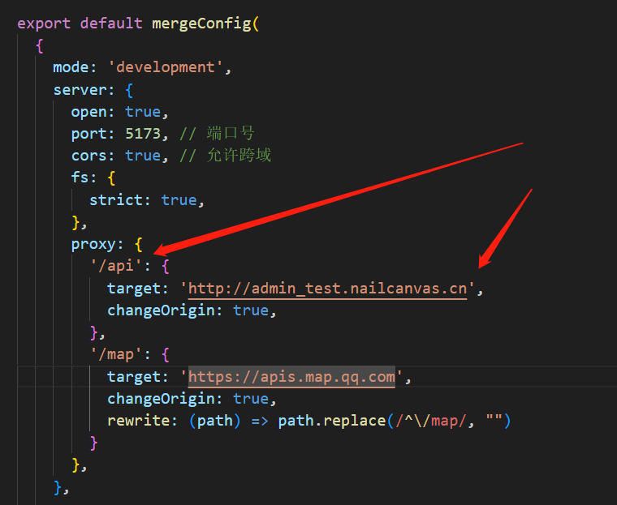
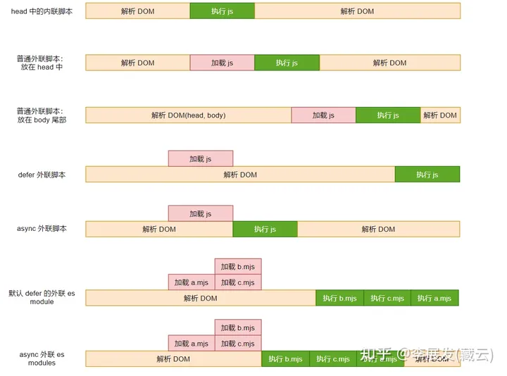

# 代码记录

## 第一周

### 跨域问题

之前实现跨域都是后端直接CROS完成的，自己前端没有实现过，也是搞了半天（~~服了~~）

主要理解前端实现跨域原理：

我们要知道，跨域的由来，即为什么会有跨域问题？？？这是因为"古时候"还没有前后端分离的概念，即前端和后端资源都是在一起的，而前后端分离之后，前后端资源就不放在一起了，那么由于浏览器的安全策略，不允许不同源的资源进行访问

前后端资源都不在一起，那么必然就触发浏览器的该**同源策略**了呗


#### 什么是同源策略

所谓**同源，是指两个地址的"协议"，"域名"，"端口"这三者都相同。**

只有当两个地址同源时，浏览器才允许它们之间进行数据通信，这就是同源策略。

同源策略（Same origin policy），最开始是由网景公司（Netscape）提出的安全策略并引入浏览器中，现在已经成为浏览器最基础的安全策略。它确保了应用的资源只能被应用自身访问。从而帮用户避免了大量来自第三方的恶意攻击，比如 XSS（跨站脚本攻击）、CSRF（跨站请求伪造） 等。

所以，当你看到上面的`No 'Access-Control-Allow-Origin' header is present on the requested resource.`报错信息，其实是浏览器拦截了从后端返回的数据，不让当前的页面访问这些数据，从而一方面避免对本地数据造成污染，一方面也避免用户数据比如 cookie 信息、账号、密码等个人信息的泄漏风险。


#### 解决办法-proxy代理

**注意：这种方法只能用于开发环境下**

那么前端要解决跨域问题，原理在于跨过浏览器

以Vue3为例是使用proxy代理解决的我们知道项目启动时nodejs会启动一个端口，而这个地址就会变成我们与后端交互的"中间人"

那么，我们前端只需把请求发送到该地址(nodejs)，再让该地址把我们的请求发送到后端，后端返回结果给中间人，中间人再给我们前端就好了

这其中，**前端从直接向后端发请求，变成了向本地node代理服务器发请求(该服务器在本地因此是同源的)，这样就实现了绕过浏览器的同源策略了，也就解决了跨域问题**

例子：

在公司的这个项目中，开发环境下的跨域方案使用的就是proxy代理


设置一个开发环境下的环境变量`/api/gw`（这里的环境变量值自行设置即可，这里设置为该值是为了与测试环境匹配，因为请求服务器的域名与测试环境下的域名一样，而`/api/gw`是前缀）

设置axios变量的baseURL为对应环境下的该环境变量值


补充说明：

注意，这个 `baseURL` 是相对于网页 URL 的。如果你的网页 URL 是 `http://localhost:8080`，那么请求的 **baseURL** 就会是 `http://localhost:8080/api/gw`后面再拼接对应内容

但是如果你的baseURL是一个完整地址

如：

```js
const service = axios.create({
    baseURL: 'http://api.example.com'
});

service.get('/users');
```

那么，axios 实际发送的请求的 URL 会是 `http://api.example.com/users`

至此，我们再设置一下代理即可，即让vite服务器（启动我们项目的服务器）代理发送请求到接口服务器



当你的应用在开发模式下运行时，如果它发送一个以 `/api` 或 `/map` 开头的请求，这个请求会被 Vite 的开发服务器接收，然后转发到指定的目标服务器。

例如，如果你的应用发送一个请求到 `/api/users`，那么这个请求实际上会被发送到 `http://admin_test.nailcanvas.cn/api/users`。

对于以 `/map` 开头的请求，你还设置了一个 `rewrite` 函数，这个函数会把请求的路径中的 `/map` 替换为空字符串。所以，如果你的应用发送一个请求到 `/map/someEndpoint`，那么这个请求实际上会被发送到 `https://apis.map.qq.com/someEndpoint`。


### Script标签引入所带来的顺序问题

- 起因是项目需要接入腾讯地图的地图api，而经查询腾讯地图在Vue中只能通过script标签引入，这里就带来了一些代码执行顺序问题
  - bug：我直接在setup的中执行有关script标签引入文件的代码，导致script标签引入的外部文件还没完全导入，因此代码报错找不到变量
  - 最后解决办法是：将有关引入内容的代码移到对应模块打开之后（即放到某个生命周期钩子里）

> 引发思考（你知道 script 标签脚本在各种情况下的加载和执行顺序吗？）：
>
> 首先清楚，script类型有哪些？？？
>
> 1. 内联脚本script（即script标签内直接写JS代码）
>
> 浏览器在解析 `html` 代码时，遇到上面的 `script` 标签时：
>
> 1. 暂停 DOM 解析过程
> 2. 执行 JS 代码
> 3. 执行完成，继续 DOM 解析过程
>
> 该过程的时序图如下：
>
> 
>
> 2. 外部脚本（即script标签使用src属性引入外部链接）
>
> 浏览器在解析 `html` 代码时遇到上面的 `script` 标签时：
>
> 1. 暂停 DOM 解析过程
> 2. 加载 a.js
> 3. 加载完成后，开始执行该脚本
> 4. 执行完成，继续 DOM 解析过程
>
> 该过程的时序图如下：
>
> 
>
> -------
>
> 上述提到的内联脚本与外部脚本，DOM解析过程中都会被打断，我们称这种方式是``同步阻塞``的
>
> 当外部脚本文件太大时，加载过程中用户会看到页面一片空白，我们称之为“白屏”现象。有一种简单的解决方式是把 script 标签插入到 body 的底部：
>
> 这种方式可以让浏览器先解析之前的内容，解析完成之后才来加载和执行 JS 脚本，过程如下：
>
> 
>
> 但是``加载JS``这一步骤并不那么重要，我们关心的是什么时候``执行JS``，因此出现了``defer/async``这两个属性来控制``加载JS``与解析DOM并行
>
> 此时：
>
> 我们把该 `script` 标签写在 `head` 里面，让浏览器尽快 `加载js` ：
>
> ```html
> <html>
> <head>
>     <script defer src="./a.js"></script>
> </head>
> </html>
> ```
>
> 该过程的时序图如下：
>
> 
>
> 使用``defer``导致执行JS会被延迟到解析DOM完成之后
>
> 如果想要尽快执行JS代码，那么可以使用``async``属性
>
> ```js
> <script async src="./a.js"></script>
> ```
>
> 该过程的时序图如下：
>
> 
>
> ------
>
> 一般我们不会同时指定``async``属性与``defer``属性，如果同时指定，``async``的优先级会更高
>
> ------
>
> 如果是es module模块脚本呢
>
> 我们通过指定 `type="module"` 来声明一个外部脚本是一个 `es` 模块：
>
> ```html
> <script type="module" src="./a.mjs"></script>
> ```
>
> 对于 `es` 模块脚本，它默认是 `defer` 的。为什么？因为 `es modules` 脚本它的依赖分析是静态的，也就是说浏览器加载了 `a.mjs` 之后，还要分析 `a.mjs` 模块通过 `import` 导入的其他依赖的模块。分别，如果 `a.mjs` 还 `import` 了 `b.mjs` 和 `c.mjs` ：
>
> ```js
> // a.mjs
> import b from "./b.mjs"
> import c from "./c.mjs"
> ```
>
> 浏览器加载 `a.mjs` 之后，还需要继续加载 `b.mjs` 和 `c.mjs` 。只有所有这些依赖模块都分析加载完毕，才能开始执行其中的 `js` 脚本，而且根据根据 `es modules` 的规则，浏览器会先执行 `b.mjs` 中的代码，然后是 `c.mjs` ，最后才是 `a.mjs` 的代码。
>
> 
>
> 总结：
>
> 
>
> [参考自：你知道 script 标签脚本在各种情况下的加载和执行顺序吗？ - 知乎 (zhihu.com)](https://zhuanlan.zhihu.com/p/464633848)


### 代码执行顺序问题


### emit顺序问题

- 组件内emit的顺序也需要注意，今天就遇到对应的bug了（~~改了几个小时，最后还是组长帮我发现的五五~~
- 即我们有时候需要父子组件双向绑定的情况，因此需要``emit('update:modelValue')``，但是有时候还需要传出change事件，因此还会``emit('change')``，这个时候一般这两个emit会写在一起，但是顺序很重要！！！
- 例如在父组件中需要在change事件中对双向绑定的值进行访问，那么我们就要优先``emit('update:modelValue')``，否则就会出现在父组件change事件中，访问不到绑定的值的情况（~~血的教训~~


### 组件封装好处

- 今天在使用封装的table组件时（对组件库table组件的封装），在组件事件传出事件对象或其他数据时，可能存在该数据并不是我们想要的数据，因此封装起来的好处就是，可以调整事件本身传出的参数即传出最方便我们的参数
  - 例如该需求是完成点击按钮进行排序，该组件库的组件对应点击事件传出的参数是tableColumn对应对象所设置的key，但是该key可能并不是排序接口所需要的值
  - 因此，我们可以重新在父组件就在column数据中专门为接口的"key"设置一个"sortKey"并且设置值为排序接口的那个字段，这样就完美解决了字段名不一致的问题（~~后端也不设置一样的字段真是的~~）


### ref与reactive的区别

今天写代码的时候，需要声明一个响应式对象，想着~~偷懒~~不用写``.value`	``，然后就出bug了。。。

原因就是，在后续逻辑中直接对reactive声明的响应式对象直接赋值一个对象了

复习``reactive``的局限性：

1. **有限的值类型**：它只能用于**复杂类型 (对象、数组和如 `Map`、`Set` 这样的集合类型](https://developer.mozilla.org/en-US/docs/Web/JavaScript/Reference/Global_Objects#keyed_collections)**)。它不能持有如 `string`、`number` 或 `boolean` 这样的[原始类型](https://developer.mozilla.org/en-US/docs/Glossary/Primitive)。

2. **不能替换整个对象**：由于 Vue 的响应式跟踪是通过属性访问实现的，因此我们必须始终保持对响应式对象的相同引用。这意味着我们不能轻易地“替换”响应式对象，因为这样的话与第一个引用的响应性连接将丢失：

   ```js
   let state = reactive({ count: 0 })

   // 上面的 ({ count: 0 }) 引用将不再被追踪
   // (响应性连接已丢失！)
   state = reactive({ count: 1 })
   ```

3. **对解构操作不友好**：当我们将响应式对象的原始类型属性解构为本地变量时，或者将该属性传递给函数时，我们将丢失响应性连接：

   ```js
   const state = reactive({ count: 0 })

   // 当解构时，count 已经与 state.count 断开连接
   let { count } = state
   // 不会影响原始的 state
   count++

   // 该函数接收到的是一个普通的数字
   // 并且无法追踪 state.count 的变化
   // 我们必须传入整个对象以保持响应性
   callSomeFunction(state.count)
   ```

所以没事还是用ref就好


### v-bind动态绑定多个值

今天发现公司项目代码中的一个写法，在组件标签上直接``v-bind="field.config"``，看了Vue文档，才发现这种写法是可以动态绑定多个值的，即``field.config``是一个对象，那么对象中的每一个键值对都会传给子组件了

```js
const objectOfAttrs = {
  id: 'container',
  class: 'wrapper'
}
<MyComponent v-bind="objectOfAttrs"><MyComponent/>
// 相当于
<MyComponent v-bind:id="container" v-bind:class="wrapper"><MyComponent/>
```


## 第二周

### dialog获取DOM元素的问题

起因：今天有个需求是需要在dialog组件退出后将页面的滚动条重置为顶部，但是因为使用的是第三方组件库arco-designer的dialog，怎么样都无法通过dialog组件的ref获取到对应的组件DOM元素，最后结论是可能原因出自于组件内部本身就不允许这样做/或者是组件内部使用了Teleport将DOM结构改变了，解决办法是重新在滚动条区域外包一层div用于获取DOM元素


### Vue3中v-if与v-for同时使用带来的问题

如下是一个例子

```vue
<div v-for="item in textValue" :key="item.text" v-if="item.show">
      {{ item.text }}
    </div>


textValue: [{ text: '宫保鸡丁', show: true }, 
			{ text: '黄焖鸡米饭', show: true }, 
			{ text: '黄焖鸡米饭', show: true }, 
			{ text: '重庆小面', show: false }, 
			{ text: '蚂蚁上树', show: true }],

```

在 Vue 中，`v-for` 和 `v-if` 同时使用在同一个元素上是不推荐的，主要有以下几个原因：

1. **可读性**：当 `v-for` 和 `v-if` 同时存在于同一个元素时，会使代码变得难以理解。`v-if` 有更高的优先级，这意味着 `v-if` 的条件将无法访问到 `v-for` 作用域内定义的变量别名。
2. **性能**：`v-if` 是一个成本较高的操作，因为它涉及到真实 DOM 的创建和销毁。如果在 `v-for` 循环中使用 `v-if`，可能会导致性能问题，因为每次循环都可能触发 DOM 的更新。

- 解决方案


1. 在外层嵌套template（使得页面渲染但不生成DOM节点）

```vue
<template v-for="item in textValue">
      <div :key="item.text" v-if="item.show" >{{item.text}}</div>
</template>
```

2. 使用计算属性提前过滤不需要的内容


```js
const dataFilter = computed(() => {
      return data.textValue.filter((res: any) => {
        return res.show !== false
    })
 })
```


### dialog组件内部嵌套组件的滚动条重置问题

先说最终的解决方案是为该嵌套组件添加变化的随时间戳变化的key``:key="new Date().getTime()"``使得每次该组件都可以被重载，从而实现滚动条重置（消耗一些性能）

原先的解决方案是：将外层dialog组件的visible(控制dialog的显示隐藏)传入该嵌套组件，嵌套组件内即可监听到dialog的关闭从而重置滚动条（但是！组件的使用是为了更好的复用，该嵌套组件未来有可能不在dialog中使用，那么这个传入这个visible在组件内的意义就不是复用了，而是单独为了在dialog中使用而使用）

更好的解决方案，在beforeClose钩子中进行重置即可


### nextTick的使用

之前对``nextTick``的认识：即延迟某些操作到下次DOM更新，nextTick存在的原因是Vue中对DOM的更新是异步的，即``确保不管你进行了多少次状态修改，每个组件都只会被更新一次``，实际上我对该方法的使用都是错误的

```js
nextTick()//错误！！！
// DOM操作
```

注意：nextTick()函数会返回一个Promise，即该函数是异步的！！！

正确使用：

1. 传入回调函数

```js
// 传入nextTick函数一个回调函数，那么你提供的回调函数将会在DOM更新后执行
nextTick(()=>{})
// 但是！nextTick()之后的代码会立即执行，不会等待DOM更新
// 这里的代码会立刻执行
```

2. 结合async/await使用

```js
await nextTick();
// 这里的代码会在DOM更新后执行
console.log(element.offsetHeight);
```

> `await`关键字是ES2017引入的，用于暂停异步函数的执行，并等待Promise的解决或拒绝，然后恢复异步函数的执行并返回解析的值。
>
> `await`关键字的工作原理基于JavaScript的事件循环和Promise。当你在异步函数中使用`await`关键字时，JavaScript会将该函数的剩余部分包装成一个回调函数，并将其添加到微任务队列中。然后，JavaScript会退出当前的异步函数，继续执行其他的同步代码。
>
> 当Promise解决或拒绝时，JavaScript会将对应的回调函数添加到微任务队列中。当事件循环到达微任务队列时，它会执行队列中的回调函数。
>
> 如果`await`后面的Promise解决，那么`await`表达式的结果就是Promise解决的值。如果Promise拒绝，那么`await`表达式会抛出一个错误，你可以使用`try/catch`语句来捕获这个错误。
>
> 需要注意的是，`await`关键字只能在`async`函数中使用。`async`函数是ES2017引入的，它是一种可以包含`await`表达式的函数。`async`函数总是返回一个Promise，这使得你可以使用`await`关键字来等待`async`函数的结果。


## 第三周

### 异步组件

今天复习了异步组件的作用（看了这篇文章[如何优雅地使用Vue3的异步组件 - 掘金 (juejin.cn)](https://juejin.cn/post/7108593780638351397)），在当前公司项目测试了一下，发现根组件的创建/挂载还是优先于子组件的，给我整蒙了？？(文章里说子组件是先于父组件加载的)

**敲黑板！！！**

在Vue中，**加载**与**挂载**是两个不同的概念！！！

**"加载"**通常指的是 JavaScript 模块或者组件的加载过程，这个过程发生在浏览器解析和执行 JavaScript 代码时。当你使用 `import` 语句导入一个模块或者组件时，浏览器会加载这个模块或者组件的代码。如果你使用异步组件，那么组件的代码会在实际需要渲染这个组件时才加载。

**"挂载"**则是 Vue 中的一个概念，指的是 Vue 将组件渲染为真实 DOM 并插入到页面中的过程。在组件的生命周期中，"挂载"发生在 `beforeMount` 和 `mounted` 钩子函数之间。当组件被挂载后，你可以在页面中看到这个组件的渲染结果。

也就是说，一个组件要**先加载，再挂载**，那么前面文章里说的（子组件先于父组件**加载**是正确的），而我在代码里看到的是组件被挂载的顺序（**父组件永远优先于子组件被挂载**，这是Vue 的生命周期钩子的执行顺序决定的）

那么回到一开始的问题，异步组件的**意义**是什么？？？

异步组件的主要目的是为了代码分割和懒加载，而不是改变组件的加载顺序。当你的应用有很多组件，或者某些组件非常大时，你可能不希望一开始就加载所有的组件。这时，你可以使用异步组件来**按需加载**组件，从而提高应用的加载速度。

当你使用异步组件时，Vue 会在组件实际需要渲染时才加载它。但是，这并不会改变父组件和子组件的创建和挂载顺序。即使子组件是异步的，父组件的创建和挂载仍然会在子组件之前。


### 异常的理解

想到之前组长说我使用async/await去进行发请求但是没有进行异常的捕获，说到"异常"我总是习惯性的不去捕获和处理，这里重新复习一下异常的概念

首先要明白异常对我们执行代码有什么影响（敲黑板）！！！

**如果我们对异常不管不顾的话，那么当执行到出现异常的时候，程序可能会立即停止**

因此，平时对异常的处理是必要的，如下这个例子：

`try...catch` 语句在 JavaScript 中用于捕获和处理异常。当你的代码可能会抛出异常时，你可以将它放在 `try` 块中。如果 `try` 块中的代码抛出了异常，那么控制流会立即转到相应的 `catch` 块，你可以在 `catch` 块中处理这个异常。

让我们看一个例子


这个例子就可以看出我们在没有进行异常处理时导致的后续代码无法正常执行

**补充说明：**

现在的前端项目中通常都会在axios中设置拦截器，例如：

```JS
import axios from 'axios';

// 添加请求拦截器
axios.interceptors.request.use(function (config) {
    // 在发送请求之前做些什么
    return config;
}, function (error) {
    // 对请求错误做些什么
    return Promise.reject(error);
});

// 添加响应拦截器
axios.interceptors.response.use(function (response) {
    // 对响应数据做点什么
    return response;
}, function (error) {
    // 对响应错误做点什么
    // 显示一个错误提示
    Notification.error({
      id: 'menuNotice',
      content: 'error',
      closable: true,
    });
    return Promise.reject(error);
});
```

我们在请求出现异常时，使用组件Notification显示一个提示消息，这个提示消息通常是通用的，此后``return Promise.reject(error);``是为了让我们可以在请求时进行额外处理异常的操作，例如跳转页面

那么什么时候，我们需要进行额外处理异常的操作呢

例子：

今天遇到一个很好的例子，因此记录一下：

这是一个图片上传组件：


当我们点击上传时，会弹出文件选择框，立即创建一个promise，在外边会声明两个变量``globalResolve``、``globalReject``存储这个promise的resolve函数与reject函数，方便在外调用，这里的事件监听是监听用户取消/确认文件框后回到window后，会启用一个定时器，reject掉创建的promise并传出用户未选择文件

```js
    function upload() {
        return new Promise((resolve, reject) => {
            globalResolve.value = resolve;
            globalReject.value = reject;
            // 唤起文件选择对话框
            uploadInputRef.value.click();
            window.addEventListener('focus', windowFocusEvent);
        });
    }

    function windowFocusEvent(e) {
        // 如果用户打开了文件选择对话框，但是没有选择任何文件，或者选择了一个文件但是没有处理这个文件，那么在  秒后，就会拒绝 Promise，表示文件上传失败。
        rejectTimeout.value = setTimeout(() => {
            globalReject.value('未选择文件');
            window.removeEventListener('focus', windowFocusEvent);
        }, 300);
    }
```

而如果用户选择了任意文件，则立刻clear掉设置的定时器，同时再次判断当前已选择的文件数量+之前选择的文件数量是否>limit，如果超出限制，也是reject掉之前创建的promise并传出最多上传limit个文件

```js
        if (props.fileList.length + files.length > props.limit) {
            globalReject.value('最多上传' + props.limit + '个文件');
            return;
        }
```

除这些之外，后续逻辑判断都正确即可使用全局的resolve进行promise状态敲定即可，在这个文件上传组件外，我们只需使用``.then``和``.catch``即可获取到上传的文件数组/各种错误字符串，这时再进行Message提示即可

```js
        uploadRef.value
            .upload()
            .then((res) => {
                // 上传成功res即为后台返回的图片URL
                fileList.value = [...fileList.value, ...res];
                emitList();
            })
            .catch((err) => {
                Message.warning(err);
            });
```

> 其他的异常捕获方法：
>
> 利用promise的.catch或者是.then的第二个参数


### 事件监听器的销毁

今天改了一个bug，原先的需求是使用promise对用户上传图片进行管理，然后如果用户点击上传图片但是没有选择图片进行上传，那么则开启用户对window的focus事件监听，对promise延时进行reject即可

出现的bug则是用户在成功上传一次图片之后，之后每次点击添加图片会出现prmise直接被延时reject了

最后调试发现是我们没有在成功上传图片/上传图片失败后对window的focus事件进行移除，导致用户不论成功/失败一次上传图片后window的focus事件一直存在，那么再次点击添加图片按钮则会导致直接触发延时reject，那么如果上传图片的时间小于设置的延时时间的话，则上传成功，反之上传失败

解决办法：在promise被reject/accept之后都要移除window的focus

教训就是添加window事件后记得移除！！！！（~~虽然不是我写的~~


### 事件监听器immidate带来的问题

需求是给一个子组件的双向绑定字段赋予初始值，而初始值由父组件传入后直接给到子组件中双向绑定的那个变量即可(无需监听器)，然后就发现死活的给不上，子组件也能够接受到传入的值

最后发现是事件监听immediate导致的数据覆盖，这个监听器是用于监听外部传入的modelValue并传给子组件的双向绑定变量的，但是在父组件一开始即使并没有传值的情况下，使用了immediate还是导致子组件的双向绑定变量被赋予了一个初始值空数组（这是因为defineProps里对modelValue的定义是默认值为空数组）


## 第四周

### arco受控与非受控

今天在使用arco组件select的时候，突然就理解了arco组件库的``受控``与``非受控``的概念，原因是我发现在使用``v-model:input``绑定组件后，组件原先内部封装好的某些操作会被取消，即如果我们对组件使用双向绑定，那么arco认为我们需要自定义组件，则组件内原先已经封装好的内容将不再生效

而非受控即我们无需使用双向绑定修改组件的值，组件的值将维护在组件内部，可以通过 `default-value` 来设置初始值。非受控模式下可以通过 `change` 事件来获取组件的值


### 父元素flex:1子元素height:100%失效问题

今天遇到该问题，看了蛮长时间，最后的解决方案是**子绝父相**

首先，我们需要清楚的是，子元素``height:100%``生效的条件是什么？？？

就是父元素的height必须是一个固定的值，而因为父元素是使用``flex:1``使得父元素的高度或宽度为**动态变化**的

所以我们无法通过子元素``height:1``来使其计算得到自己的高度/宽度

解决办法：

1. 设置**子绝父相**

这种方法之所以有效，是因为绝对定位的元素的宽度和高度是相对于其最近的定位祖先元素（即设置了 `position` 属性的元素）计算的，而不是其父元素。如果没有定位的祖先元素，那么就相对于初始包含块（通常是整个文档窗口）。

在你的代码中，父 元素设置了 `position: relative`，这使得它成为了 子元素 的定位祖先元素。因此，当 子元素 设置了 `position: absolute` 和 `height: 100%` 时，它的高度就会等于 父元素 的高度。

这种方法的优点是，即使父元素的高度是动态变化的，子元素也能始终占满父元素的高度。但是，需要注意的是，绝对定位的元素会脱离正常的文档流，这可能会影响到布局。例如，它可能会覆盖其他的元素，或者被其他元素覆盖。因此，在使用这种方法时，需要确保这是你想要的效果。

2. 使用JS动态设置子元素的高度


### tab-bar组件业务逻辑实现

实习前想做的tab-bar组件即一个记录用户打开内容的tab栏，但是没有实现的，现在在arco中看到，特此记录学习

在arco中整个功能由两个组件(tab-bar、tab-item)和一个store(pinia)实现

其中：

与tab-bar相关的内容都存储在一个pinia仓库中，数据结构如下

```js
  state: (): TabBarState => ({
    cacheTabList: new Set([DEFAULT_ROUTE_NAME]),
    tagList: [DEFAULT_ROUTE],
  }),
  getters: {
    getTabList(): TagProps[] {
      return this.tagList;
    },
    getCacheList(): string[] {
      return Array.from(this.cacheTabList);
    },
  },
// tagList用于存储所有标签
// cacheTabList用于存储需要缓存的标签
```

相关操作：

```js
actions: {
    updateTabList(route: RouteLocationNormalized) {
      // 当前路由不在禁止列表内，则加入tagList，如果需要缓存则加入缓存set内
      if (BAN_LIST.includes(route.name as string)) return;
      this.tagList.push(formatTag(route));
      if (!route.meta.ignoreCache) {
        this.cacheTabList.add(route.name as string);
      }
    },
    deleteTag(idx: number, tag: TagProps) {
      // 删除某个tag（同时在缓存中删除）
      this.tagList.splice(idx, 1);
      this.cacheTabList.delete(tag.name);
    },
    addCache(name: string) {
      // 加入缓存（路由非空）
      if (isString(name) && name !== '') this.cacheTabList.add(name);
    },
    deleteCache(tag: TagProps) {
      // 删除某个tag的缓存
      this.cacheTabList.delete(tag.name);
    },
    freshTabList(tags: TagProps[]) {
      // 更新列表
      this.tagList = tags;
   	  // 清空缓存
      this.cacheTabList.clear();
      // 要先判断ignoreCache
      // 更新tagList后，同时更新缓存set
      this.tagList
        .filter((el) => !el.ignoreCache)
        .map((el) => el.name)
        .forEach((x) => this.cacheTabList.add(x));
    },
    resetTabList() {
      // 重置两个state
      this.tagList = [DEFAULT_ROUTE];
      this.cacheTabList.clear();
      this.cacheTabList.add(DEFAULT_ROUTE_NAME);
    },
  },
```

在tab-bar组件中我们监听路由变化，判断当前前往路由是否是`特殊`的/存储tag的`tagList`是否已经存在一个tag的路由与之相同，只有上述条件都不满足时我们才进行state变量的更新

在tab-bar组件中获取仓库中的tagList数组进行渲染，`tag-item`组件

在`tag-item`组件中，我们将tag的内容渲染出来，为保证有一个tag一直存在，我们使用css选定第一个tag的关闭按钮`display: none`，关闭的逻辑即调用仓库的`deleteTag`方法即可，但是我们要判断如果当前删除的是当前显示的tag，那么我们需要选择当前`tagList`的最后一个标签的路由作为下一个显示内容

实际上，arco的`tag-item`组件还封装了对标签右键后的某些操作，但这里只为实现基本功能，因此不加以讲解

我们想要实现刷新页面后还能够回到刷新前的那个页面这个功能：

在arco中借助``发布订阅模式``监听路由变化实现了该功能

`mitt` 是一个非常小巧的事件发射器库，它提供了 `on`、`off` 和 `emit` 三个方法，分别用来添加事件监听器、移除事件监听器和触发事件（`mitt`实际上是vue3对vue2中eventbus的替代）。

```js
/**
 * Listening to routes alone would waste rendering performance. Use the publish-subscribe model for distribution management
 * 单独监听路由会浪费渲染性能。使用发布订阅模式去进行分发管理。
 */
import mitt from 'mitt';

const emitter = mitt();

// 使用symbol避免事件名称冲突
const key = Symbol('ROUTE_CHANGE');

// 关键：存储最后的路由
let latestRoute;

export function setRouteEmitter(to) {
  // 发布者发布“路由改变了”
  emitter.emit(key, to);
  // 同时更新上次路由是什么
  latestRoute = to;
}

export function listenerRouteChange(handler, immediate = true) {
  emitter.on(key, handler);
  // 订阅某个事件
  if (immediate && latestRoute) {
    // 立即处理
    handler(latestRoute);
  }
}

export function removeRouteListener() {
  // 取消订阅
  emitter.off(key);
}

```

在``tag-bar``组件中，有这样一段

```js
  listenerRouteChange((route) => {
    if (
      !route.meta.noAffix &&
      !tagList.value.some((tag) => tag.fullPath === route.fullPath)
    ) {
      tabBarStore.updateTabList(route);
    }
  }, true);
```

相当于，满足条件的情况下，我们就会立刻订阅路由改变的事件，刷新时`latestRoute`会作为参数传递给回调函数因此可以更新当前`tabList`

但是，有一个问题是`latestRoute`怎么得到？？？

实际上，在arco中，只要在路由守卫中"发布者"进行"发布"就好了，同时更新latestRoute（这里需要注意的是在刷新页面刚进入时也会有路由守卫的效果+单页面应用刷新时不会导致路由刷新），因此每次进入页面我们都能够得到上一次最后的路由~~~


### jsonp

今天在完成一个地图组件的功能（腾讯地图），但是因为只在测试环境下没有做跨域，又遇到跨域问题了，腾讯官方文档说的是使用**jsonp**解决，但是我没有使用过jsonp，特此记录学习：

前面经过学习已经明白了代理解决跨域的原理，jsonp也是一种方法去解决跨域

对于 img、js 这种文件资源，当你使用``或者`<script src="xxx"></script>`的时候，似乎同源策略并没有发生作用。

是的，html 元素的 src 属性是一个例外，**src 属性不受到同源策略的限制**，也正是基于此，才有了 jsonp，也因此，**jsonp 只能支持 get 请求**

本质上，是设置一个`callback`字段在src属性中，然后后台只需要在回调函数的参数中给与我们接口返回的结果就好了

```js
function jsonp (url,data,fn){
    if(!url)
        throw new Error('url is necessary')
    // src中的回调函数名，这里只是一个临时的名字，为了避免多个请求时window方法重名
    const callback = 'CALLBACK' + Math.random().toString().substr(9,18)
    const JSONP = document.createElement('script')
          JSONP.setAttribute('type','text/javascript')

    // 准备放在head标签中
    const headEle = document.getElementsByTagName('head')[0]

    let ret = '';
    if(data){
        // 其他参数的字符串拼接
        if(typeof data === 'string')
            ret = '&' + data;
        else if(typeof data === 'object') {
            for(let key in data)
                ret += '&' + key + '=' + encodeURIComponent(data[key]);
        }
        ret += '&_time=' + Date.now();
    }
    JSONP.src = `${url}?callback=${callback}${ret}`;

    // 注册对应的回调函数
    window[callback] = function(r){
      fn && fn(r)
      // 得到返回值，清除标签+删除注册的window方法
      headEle.removeChild(JSONP)
      delete window[callback]
    }
	
    headEle.appendChild(JSONP)
}
```

> 实际上，在axios中也可以进行封装jsonp
>
> ```js
> instance.jsonp = (url, data) => {
>   if (!url)
>     throw new Error('url is necessary')
>   const callback = 'CALLBACK' + Math.random().toString().substr(9, 18)
>   const JSONP = document.createElement('script')
>   // JSONP.type = 'text/javascript';
>   JSONP.setAttribute('type', 'text/javascript')
>
>   const headEle = document.getElementsByTagName('head')[0]
>
>   let ret = '';
>   if (data && typeof data === 'object') {
>     for (let key in data) {
>       ret += '&' + key + '=' + encodeURIComponent(data[key]);
>     }
>   }
>   JSONP.src = `${instance.defaults.baseURL + url}?callback=${callback}&output=jsonp${ret}`;
> 	// 使用promise进行返回
>     return new Promise((resolve, reject) => {
>     window[callback] = r => {
>       resolve(r)
>       headEle.removeChild(JSONP)
>       delete window[callback]
>     }
>     headEle.appendChild(JSONP)
>   })
>
> }
>
> ```
>
> 


### vue字段规范

- 组件名：`MyComponent` 为名注册的组件，在模板中可以通过 `<MyComponent>` 或 `<my-component>` 引用（推荐使用`<MyComponent>`）
- 事件名：推荐在父组件中使用`` kebab-case ``的形式来监听
- 组件prop名：组件内定义时推荐使用`camelCase`，组件外传递时推荐使用`kebab-case`


