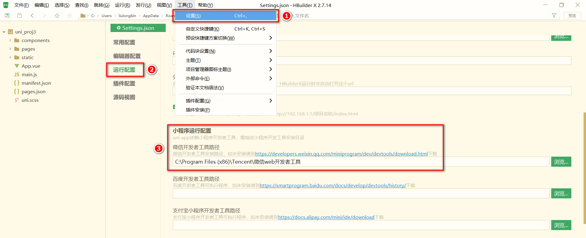
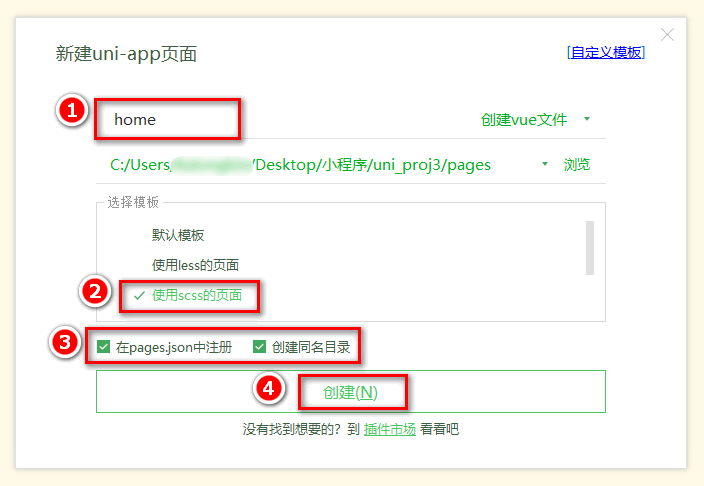

# 起步

## uniapp简介

**uni-app 是一个使用 Vue.js 开发所有前端应用的框架**。开发者编写一套代码，可发布到 iOS、Android、H5、以及各种小程序（微信/支付宝/百度/头条/QQ/钉钉/淘宝）、快应用等多个平台。


> 详细的 uni-app 官方文档，请翻阅 https://uniapp.dcloud.net.cn/


## 开发工具

uni-app 官方推荐使用 **HBuilderX** 来开发 uni-app 类型的项目。主要好处：

- 模板丰富
- 完善的智能提示
- 一键运行

> 当然，你依然可以根据自己的喜好，选择使用 VS Code、Sublime、~~记事本~~... 等自己喜欢的编辑器！


### 下载并按照HBuilderX 

官网如下：[HBuilderX-高效极客技巧 (dcloud.io)](https://www.dcloud.io/hbuilderx.html)


### 安装插件

进入到uniapp官网提供的插件市场进行下载安装即可，并且可以一键导入

> https://ext.dcloud.net.cn/plugin?name=compile-node-sass


## 目录结构

一个 uni-app 项目，默认包含如下目录及文件（不同模版可能不同）：

```
┌─components            uni-app组件目录
│  └─comp-a.vue         可复用的a组件
├─pages                 业务页面文件存放的目录
│  ├─index
│  │  └─index.vue       index页面
│  └─list
│     └─list.vue        list页面
├─static                存放应用引用静态资源（如图片、视频等）的目录，注意：静态资源只能存放于此
├─main.js               Vue初始化入口文件
├─App.vue               应用配置，用来配置小程序的全局样式、生命周期函数等
├─manifest.json         配置应用名称、appid、logo、版本等打包信息
└─pages.json            配置页面路径、页面窗口样式、tabBar、navigationBar 等页面类信息
```


## 将项目运行到微信开发者工具中

1. 在HBuilderX中配置自己微信开发者工具的AppId


2. 配置本机微信开发者工具的安装目录



3. 微信开发者工具打开``服务端口``(即允许第三方工具调用微信开发者工具的功能)


4. 在 HBuilderX 中，点击菜单栏中的 `运行 -> 运行到小程序模拟器 -> 微信开发者工具`，将当前 uni-app 项目编译之后，自动运行到微信开发者工具中，从而方便查看项目效果与调试：


## 使用Git管理项目

### 本地管理

1. 在项目根目录中新建 `.gitignore` 忽略文件，并配置如下：

```
# 忽略 node_modules 目录
/node_modules
/unpackage/dist
```

> 注意：由于我们忽略了 unpackage 目录中**仅有的** dist 目录，因此默认情况下， unpackage 目录不会被 Git 追踪

> 此时，为了让 Git 能够正常追踪 unpackage 目录，按照惯例，我们可以在 unpackage 目录下创建一个叫做 `.gitkeep` 的文件进行占位

1. 打开终端，切换到项目根目录中，运行如下的命令，初始化本地 Git 仓库：

```
git init
```

1. 将所有文件都加入到暂存区：

```
git add .
```

1. 本地提交更新：

```
git commit -m "init project"
```


# tabBar


## 创建tabBar分支

运行如下的命令，基于 master 分支在本地创建 tabBar 子分支，用来开发和 tabBar 相关的功能：

```
git checkout -b tabbar
```


## 创建tabBar页面

在 `pages` 目录中，创建首页(home)、分类(cate)、购物车(cart)、我的(my) 这 4 个 tabBar 页面。在 HBuilderX 中，可以通过如下的两个步骤，快速新建页面：

1. 在 `pages` 目录上鼠标右键，选择**新建页面**

2. 在弹出的窗口中，填写**页面的名称**、**勾选 scss 模板**之后，点击创建按钮。截图如下：

   


## 配置tabBar

1. 修改项目根目录中的 `pages.json` 配置文件，新增 `tabBar` 的配置节点如下：

   ```
   {
     "tabBar": {
       "selectedColor": "#C00000",
       "list": [
         {
           "pagePath": "pages/home/home",
           "text": "首页",
           "iconPath": "static/tab_icons/home.png",
           "selectedIconPath": "static/tab_icons/home-active.png"
         },
         {
           "pagePath": "pages/cate/cate",
           "text": "分类",
           "iconPath": "static/tab_icons/cate.png",
           "selectedIconPath": "static/tab_icons/cate-active.png"
         },
         {
           "pagePath": "pages/cart/cart",
           "text": "购物车",
           "iconPath": "static/tab_icons/cart.png",
           "selectedIconPath": "static/tab_icons/cart-active.png"
         },
         {
           "pagePath": "pages/my/my",
           "text": "我的",
           "iconPath": "static/tab_icons/my.png",
           "selectedIconPath": "static/tab_icons/my-active.png"
         }
       ]
     }
   }
   ```


## 删除默认的 index 首页

1. 在 HBuilderX 中，把 `pages` 目录下的 `index首页文件夹` 删除掉
2. 同时，把 `page.json` 中记录的 `index 首页` 路径删除掉
3. 为了防止小程序运行失败，在微信开发者工具中，手动删除 `pages` 目录下的 `index 首页文件夹`


## 修改导航条的样式效果

1. 打开 `pages.json` 这个全局的配置文件

2. 修改 `globalStyle` 节点如下：

   ```
   {
     "globalStyle": {
       "navigationBarTextStyle": "white",
       "navigationBarTitleText": "黑马优购",
       "navigationBarBackgroundColor": "#C00000",
       "backgroundColor": "#FFFFFF"
     }
   }
   ```


# 首页

## 配置网络请求

由于平台的限制，小程序项目中**不支持 axios**，而且原生的 `wx.request()` API 功能较为简单，**不支持拦截器**等全局定制的功能。因此，建议在 uni-app 项目中使用 `@escook/request-miniprogram` 第三方包发起网络数据请求（记得在小程序官方平台对自己请求的域名进行运行访问）。

> 请参考 **@escook/request-miniprogram** 的官方文档进行安装、配置、使用

> 官方文档：https://www.npmjs.com/package/@escook/request-miniprogram

最终，在项目的 `main.js` 入口文件中，通过如下的方式进行配置：

```
import { $http } from '@escook/request-miniprogram'

uni.$http = $http
// 配置请求根路径
$http.baseUrl = 'https://www.uinav.com'

// 请求开始之前做一些事情
$http.beforeRequest = function (options) {
  uni.showLoading({
    title: '数据加载中...',
  })
}

// 请求完成之后做一些事情
$http.afterRequest = function () {
  uni.hideLoading()
}
```


